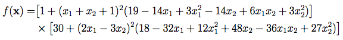

<!--Don't delete ths script-->
<script src = "https://polyfill.io/v3/polyfill.min.js?features=es6"></script>
<script id = "MathJax-script" async src="https://cdn.jsdelivr.net/npm/mathjax@3/es5/tex-mml-chtml.js"></script>
<!--Don't delete ths script-->

```python
of = goldsteinPrice(x)
```

<p align="justify">
     The Goldstein-Price function has several local minima.
</p>

Equation
{: .label .label-blue}


Input variables
{: .label .label-yellow }

<table style = "width:100%">
    <thead>
      <tr>
        <th>Name</th>
        <th>Description</th>
        <th>Type</th>
      </tr>
    </thead>
    <tr>
        <td><code>x</code></td>
        <td>This is a list or array representing the input vector to the Goldstein Price function. It is the point at which the function is evaluated.</td>
        <td>Py list </td>
    </tr>
</table>

Output variables
{: .label .label-yellow }

<table style = "width:100%">
    <thead>
      <tr>
        <th>Name</th>
        <th>Description</th>
        <th>Type</th>
      </tr>
    </thead>
    <tr>
        <td><code>of</code></td>
        <td>It represents the result of evaluating the Goldstein Price function at the given input x.</td>
        <td>float</td>
    </tr>
</table>

<h3>Problem</h3>

<table style = "width:100%">
    <tr>
        <td style="width: 90%;">\[ f(\mathbf{x}) =  \left [ 1 + (x_{1} + x_{2} + 1)^2 (19 - 14x_{1} + 3x^2_{1} - 14x_{2} + 6x_{1}x_{2} +3x^2_{2}) \right ] +                                  \left [ 30 + (2x_{1} + 3x_{2} )^2   (18-32x_{1} + 12x^2_{1} + 48x_{2}  - 36x_{1}x_{2} + 27x^2_{2})    \right ]    \]</td>
        <td style="width: 10%;"><p align = "right">(1)</p></td>
    </tr>
    <tr>
        <td style="width: 90%;">\[f(\mathbf{x}^*) = 3, \; \mathbf{x}^* =(0, 1)    \]</td>
        <td style="width: 10%;"><p align = "right">(2)</p></td>
    </tr>
</table>

Example 1
{: .label .label-blue }

<p align = "justify">
  <i>
      Considering the design variable \(\mathbf{x} = [0, -1]\), what value does the objective function expect?
  </i>
</p>

```python
# Data
x_goldsteinPrice = [0, -1]

# Call function
of_goldsteinPrice = goldsteinPrice(x_goldsteinPrice, None)

# Output details
print("of_best goldstein-Price: of = {:.4f}".format(of_goldsteinPrice))

```

```bash
of_best goldstein-Price: of = 3.0000
```
