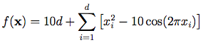

<!--Don't delete ths script-->
<script src = "https://polyfill.io/v3/polyfill.min.js?features=es6"></script>
<script id = "MathJax-script" async src="https://cdn.jsdelivr.net/npm/mathjax@3/es5/tex-mml-chtml.js"></script>
<!--Don't delete ths script-->

```python
result = rastrigin(x=x, none_variable=None)
```

<p align="justify">
The Rastrigin function has several local minima. It is highly multimodal, but locations of the minima are regularly distributed.
</p>

Equation
{: .label .label-blue}


Input variables
{: .label .label-yellow }

<table style = "width:100%">
    <thead>
      <tr>
        <th>Name</th>
        <th>Description</th>
        <th>Type</th>
      </tr>
    </thead>
    <tr>
        <td><code>x</code></td>
        <td>Input vector containing the coordinates of the point for which the Rastrigin function value is to be calculated.</td>
        <td>Py list </td>
    </tr>
</table>

Output variables
{: .label .label-yellow }

<table style = "width:100%">
    <thead>
      <tr>
        <th>Name</th>
        <th>Description</th>
        <th>Type</th>
      </tr>
    </thead>
    <tr>
        <td><code>of</code></td>
        <td>The value of the Rastrigin function for the given input vector x. It is a scalar value representing the fitness or objective function value.</td>
        <td>float</td>
    </tr>
</table>
