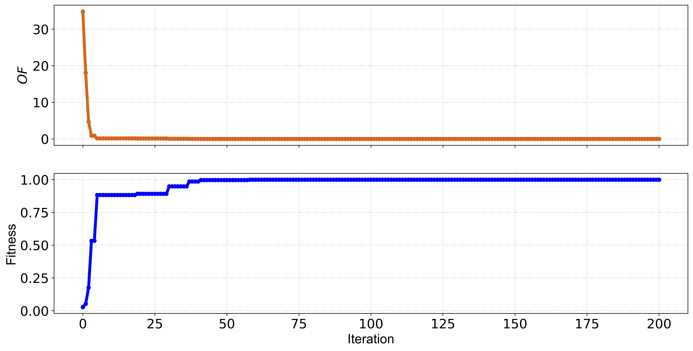

<h1><i>How to use</i></h1>

<p align="justify">To use one of the library's functions, it is necessary to import.</p>

<h3><i>Optimization functions</i></h3>

Call optimization algorithm example:
```python
# import standard Simulated Annealing Optimization Algorithm
from META_TOOLBOX import SA_ALGORITHM_0001
```
<p align="justify"> Optimization functions return results from the iterative process.</p>
   
```RESULTS_REP```: All results of the population movement (Python dictionary)  
> Tag contents in dictionary  
- ```ID_PARTICLE```: i particle, 0 unitil (*N_POP - 1*)   
- ```X_POSITION```: *X* design variables movement of *i* particle (equals ID Partcile) per iteration  
- ```OF```: OF values of *i* particle (equals ID Partcile) per iteration 
- ```FIT```: Fitness values of *i* particle (equals ID Partcile) per iteration  
- ```???_PARAMETERS```: Internal parameters of the optimization method (In **SA** for example this tag stores temperature annealing schedule) per iteration  
- ```NEOF```: Number of objective function evaluations per iteration 

View results of second particle (**id: 1**):   
```python
RESULTS_REP[1]
```
Obs.: In Pyhton the internal counter start in zero value!   
  
```BEST_REP```: Best population results (Python dictionary) 
> Tag contents in dictionary  
- ```ID_PARTICLE```: id best particle, 0 unitil (N_POP - 1)   
- ```X_POSITION```: *X* design variables movement of *i* particle (equals ID Partcile) per iteration
- ```OF```: OF values of *i* particle (equals ID Partcile) per iteration  
- ```FIT```: Fitness values of *i* particle (equals ID Partcile) per iteration  
- ```???_PARAMETERS```: Internal parameters of the optimization method (In **SA** for example this TAG stores Temperature annealing schedule) per iteration  
- ```NEOF```: Number of objective function evaluations per iteration  

View results of first repetition:   
```python
BEST_REP[0]
```

```AVERAGE_REP```: Average OF and FIT results (Python dictionary) 
> Tag contents in dictionary  
- ```OF```: OF values of *i* particle (equals ID Partcile) per iteration  
- ```FIT```: Fitness values of *i* particle (equals ID Partcile) per iteration  
- ```NEOF```: Number of objective function evaluations per iteration  

View results of first repetition:   
```python
AVERAGE_REP[0]
```

```WORST_REP```: Worst OF and FIT results (Python dictionary) 
> Tag contents in dictionary  
- ```OF```: OF values of *i* particle (equals ID Partcile) per iteration  
- ```FIT```: Fitness values of *i* particle (equals ID Partcile) per iteration  
- ```NEOF```: Number of objective function evaluations per iteration  

View results of first repetition:   
```python
WORST_REP[0]
```

<h3><i>Graphical functions</i></h3>

> Functions
- ```META_PLOT_001```: OF + FIT chart - Line chart
- ```META_PLOT_002```: OF or FIT chart - Line chart

Call function in graphic library example:
```python
# import line chart OF and Fitness
from META_TOOLBOX import META_PLOT_001
```
Figure output:  



