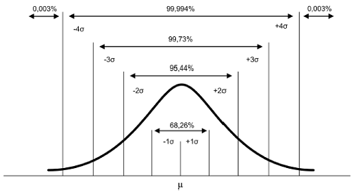
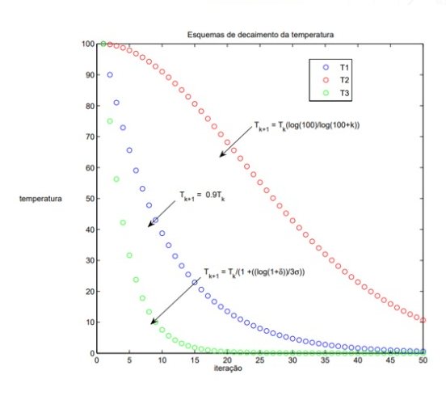

<script src="https://polyfill.io/v3/polyfill.min.js?features=es6"></script> 
<script id="MathJax-script" async src="https://cdn.jsdelivr.net/npm/mathjax@3/es5/tex-mml-chtml.js"></script>

### MÉTODO DO RECOZIMENTO SIMULADO (_SA0001_)

<p align="justify"> 
O método de Recozimento Simulado (em inglês <i>Simulated Annealing</i>) foi desenvolvido na década de 80 pelos autores Kirkpatrick1, Gelatt Jr. e Vecchi <a href="https://science.sciencemag.org/content/220/4598/671">[1]</a>. Tal método tem como base teórica o processo de fundição de metais. O termo recozimento (em inglês <i>Annealing</i>) é o processo utilizado para fundir um metal, onde este é aquecido a uma temperatura elevada (estado de maior agitação dos átomos) e em seguida é resfriado lentamente, de modo que o produto final seja uma massa homogênea <a href="https://tema.sbmac.org.br/tema/article/view/141">[2]</a>. Na engenharia de materiais o recozimento é conhecido como um tratamento térmico que visa alterar as propriedades da liga metálica conforme o aço que deseja-se produzir. Tal processo visa mitigar falhas no material como o acumulo das tensões internas durante o processo de fabricação. <br>

O Recozimento Simulado (em inglês <i>Simulated Annealing</i>) é um método otimização com natureza probabilística (ou uma heurística). O mesmo parte da ideia de uma busca local baseada na determinação de um vizinho a partir de uma ditribuição onde o valor médio (\(\mu\)) é a posição da partícula (\(x_{i}^t\)) na iteração \(t\). Normalmente a distribuição empregada para determinação do vizinho é a distribuição normal conforme Figura apresentada a seguir: <br>



</font> 
</p>

``` python
# Algoritmo em linguagem Python 3
# Declaração de dados iniciais pelo usuário
N_ITER, I_COUNT, T_I, X_MIN, X_MAX, ALPHA, SIGMA
X = POP_INIT(X_MIN, X_MAX)
# Avalia FO e FIT das partículas
OF = OBJ(X)
FIT = FITNESS(OF)
# Definição da temperatura e iterador
T = T_I
I_COUNT = 0
while (I_COUNT < N_ITER):
      # Encontrando o vizinho via distribuição pré-definida
      X_NEW = PERTURBA_PONTO(X, SIGMA)
      # Avalia FO e FIT das novas partículas
      OF_NEW = OBJ(X_NEW)
      FIT_NEW = FITNESS(OF_NEW)
      DELTA_E = OF_NEW - OF
      # Condição para armazenamento das variáveis
      if (DELTA_E < 0):
          PROB = 1
      elif (DELTA_E >= 0):
          PROB = exp(-DELTA_E / TEMP):
      RANDOM = RAND()
      if RANDOM < PROB:
         X = X_NEW
         OF = OF_NEW
         FIT = FIT_NEW
      # Atualiza temperatura geometricamente e contador interno
      T = T * ALPHA
      I_COUNT = I_COUNT + 1  
# Imprimindo os valores finais
print(X, OF, FIT)
```
<ul>
<li>\( T_{i} \) (<font face="Courier New">T_I</font>) é a Temperatura Inicial.</li>
<li>\( x_{min} \) e \( x_{min} \) (<font face="Courier New">X_MIN</font>) e (<font face="Courier New">X_MAX</font>) é o intervalo mínimo e máximo das variáveis de projeto.</li>
<li>\( iter \) (<font face="Courier New">N_ITER</font>) é o número máximo de iterações.</li>
<li>\( x_{i}^t \) (<font face="Courier New">X</font>) é a posição da partícula no espaço na iteração \( t \).</li>
<li>\( x_{i}^{t+1} \) (<font face="Courier New"> X_NEW </font>) é a posição da partícula no espaço na iteração \( t + 1 \).</li>
<li>\( \Delta E \) (<font face="Courier New">DELTA_E</font>) é a variáção de energia do sistema dado por \( \Delta E = f(x_{i}^{t+1}) - f(x_{i}^t)\).</li>
 <li>\( T \) (<font face="Courier New">TEMP</font>) é a Temperatura atual do sistema.</li>
<li>\( f(x_{i}^t) \) (<font face="Courier New">OF</font>) é o valor da função objetivo no ponto \( x_{i}^t \).</li>
<li>\( f(x_{i}^{t+1}) \) (<font face="Courier New"> OF_NEW </font>) é o valor da função objetivo no ponto \( x_{i}^{t+1} \).</li>
<li>\( prob \) (<font face="Courier New">PROB</font>) é o valor da probabilidade de aceite da solução. Para valores de \( \Delta E \geq 0 \) utilizar \( e^{\frac{-\Delta E}{T}} \).Já para valores de \( \Delta E < 0 \) o valor da probabilidade de aceite é 1.</li>
<li>\( \sigma \) (<font face="Courier New">SIGMA</font>) é o valor do desvio padrão em uma distribuição normal para gerar o valor vizinho.</li>
<li>\( \alpha \) (<font face="Courier New">ALPHA</font>) é o valor do coeficiente de redução da temperatura por iteração (coeficiente de resfriamento geometrico).</li>
</ul> 

Além dessas variáveis também existem as seguintes funções:
<ul>
<li><font face="Courier New">PERTURBA_PONT(X, SIGMA)</font>: Função que pertuba um ponto <font face="Courier New">X</font> e retorna um novo ponto <font face="Courier New">X_NEW</font>.</li>
<li><font face="Courier New">FO(X)</font>: Função que retorna o valor da função objetivo no ponto <font face="Courier New">X</font>.</li>
<li><font face="Courier New">FIT(X)</font>: Função que retorna o valor da aptidão para um detemrinado valor de <font face="Courier New">OF</font>.</li>
<li><font face="Courier New">RAND(X)</font>: Função que retorna um valor randômico entre 0 e 1.</li>
</ul> 

<p align="justify"> 
Na prática o Recozimento Simulado pode ser comparado com o algoritmo chamado Subida de Encosta (em inglês <i>Hill Climbing</i>), neste último o vizinho gerados só é aceito caso seu valor de aptidão for maior que o passo anterior (em termos de função objetivo \( f(x_{i}^{t+1}) < f(x_{i}^t)\)). Porém essa estratégia pode fazer com que a partícula fique preso em um máximo ou mínimo local, não sendo possível convergir para um valor ótimo global. <br>

Já no Recozimento Simulado existe um mecanismo probabilístico de aceite de soluções que permite que as partículas encontrem posições do espaço com redução da aptidão da partícula (em termos de função objetivo \( f(x_{i}^{t+1}) < f(x_{i}^t)\)). Tal mecanismo permite que o algoritmo faça uma exploração melhor do espaço de busca e não fique preso em valores locais. Porém esse mecanismo é mais eficiente nas iterações iniciais onde as temperaturas de recozimento são altas (<b>fisicamente</b> isso seria análogo a um maior grau dee <b>agitação</b> das partículas no epsaço de busca), pois a medida que o processo iterativo ocorre a tendência é uma queda da temperatura (<b>fisicamente</b> um menor grau de <b>agitação</b> das partículas).<br>

Note os seguintes gráficos: <br>

 <br>

No gráfico da esquerda temos a queda da temperatura com três tipos diferentes de decaimento:<br>
<ul>
<li>\( T_{1} \) (<font face="Courier New">T_I</font>) que representa uma diminuição controlada.</li>
<li>\( T_{2} \) (<font face="Courier New">T_I</font>) que representa uma diminuição lenta.</li>
<li>\( T_{3} \) (<font face="Courier New">T_I</font>) que representa uma diminuição rápida.</li>
</ul>

Alguns algoritmos de Recozimento Simulado apresentam técnicas de <i>start</i> de temperatura e também outros modelos de decaimento da temperatura (em inglês <i>Annealing Schedule</i>). Tais processos serão abordados em outros algoritmos de recozimento.<br>

São exemplos de problemas onde é empregado o algoritmo de Recozimento Simulado:

</p>

<ul>
<li>Problema do Caixeiro Viajante.</li>
<li>Problema de Alocação.</li>
<li>Problema de Agendamento.</li>
<li>Problema inverso <a href="https://arxiv.org/abs/2005.08295">[???]</a>.</li> 
</ul> 
