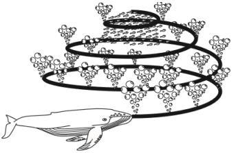

 

<h1>ALGORITMO DE OTIMIZAÇÃO DAS BALEIAS (WOA)</h1>

<h2>INTRODUÇÃO</h2>
 
<body>
 

 
 O algoritmo de otimização das baleias <i>(Whale Optimization Algorithm – WOA)</i> é um algoritmo baseado em enxames, que utiliza o comportamento das baleias jubarte como base para seu algoritmo Biospirado. Esse algoritmo foi inspirado no comportamento de caça de baleias jubarte, de forma a simular o seu movimento na busca por uma fonte de alimento Mirjalili e Lewis<a href="https://www.scirp.org/journal/paperinformation.aspx?paperid=101268">[1]</a>.  
   
Entendo isso, podemos partir para os 3 elementos principais para o processo de busca do algoritmo, de acordo com Mirjalili e Lewis<a href="https://www.scirp.org/journal/paperinformation.aspx?paperid=101268">[2]</a>: 
 <ul>
 <li>Circundar Presa: As baleias jubarte podem reconhecer a localização das presas e circundá-las. Uma vez que a posição do desenho ótimo no espaço de pesquisa não é conhecida a priori, o algoritmo WOA assume que a solução melhor candidata atual é a presa alvo ou está próxima do ótimo. Depois que a melhor baleia é definida, as outras baleias, portanto, tentam atualizar suas posições para a melhor baleia. Esse comportamento é representado pela Equação:  
  onde t indica a itera¸c˜ao atual, A e C s˜ao vetores de coeficientes, xbest ´e o vetor de posi¸c˜ao
da melhor solu¸c˜ao obtida at´e agora, xi ´e o vetor de posi¸c˜ao. Vale a pena mencionar aqui
que xbest deve ser atualizado em cada itera¸c˜ao se houver uma solu¸c˜ao melhor. A vari´avel a
´e linearmente diminu´ıda de 2 para 0 ao longo das itera¸c˜oes (tanto nas fases de explora¸c˜ao
global como de explora¸c˜ao local) e r ´e um vetor aleat´orio em [0,1].</li>
  
 </ul>

 
</body>

