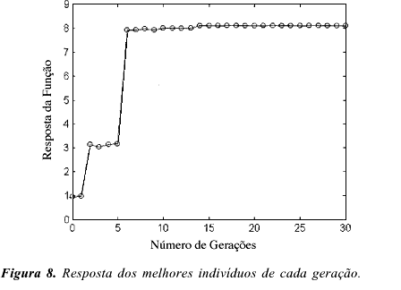
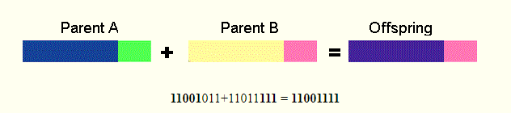
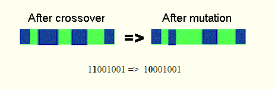

<script src="https://polyfill.io/v3/polyfill.min.js?features=es6"></script> 
<script id="MathJax-script" async src="https://cdn.jsdelivr.net/npm/mathjax@3/es5/tex-mml-chtml.js"></script>

<h1>ALGORITMO GENÉTICO (_SA0005_)</h1>

<h2>Introdução</h2>
  
<p align="justify"> 
    A ideia inicial deste é de utilizar um algoritmo que simula a realidade, no sentido de sobrevivência em um ecossistema segundo Darwin, já que para ele, na natureza apenas os indivíduos mais aptos são os que conseguem sobreviver, ter descendentes e teoricamente evoluir. Com isso trazemos para computação toda esses métodos evolutivos pensados na biologia como hereditariedade, mutação, recombinação e seleção natural.<br>
    A partir desses conceitos, os algoritmos genéticos (em inglês <i>Genetic Algorithm</i>) foram criados em 1975 por John holland em sua publicação "Adaption in Natural and Artificial Systems" e juntamente com a programação genética formam um ramo da computação evolucionaria, ramo de pesquisa iniciada da inteligência artificial que usa um novo paradigma de solução de problemas inspirado na teoria da seleção natural escrito por Darwin em 1859.<br>
  Hoje, esse é um dos métodos de resolução de problemas mais conhecidos e considerado um dos pilares da inteligência artificial sendo usada para achar soluções de problemas com uma ótima taxa de acerto se executado corretamente, isso se deve principalmente por suas características bem únicas derivadas da biologia que o diferencia de outros métodos de soluções de problemas.
</p>

<h2>Características</h2>
  
<p align="justify"> 
  Como dito anteriormente, os algoritmos genéticos tem caracteríscas que o levam a ser diferente de outros métodos de otimização e solucionadores de problemas. Estas sendo:
  <ul>
    <li>Já que estamos lidando com um "ecossistema", o resultado final não é único e sim uma população de possíveis soluções.</li>
    <li>É usado métodos probabilísticos ao invés dos métodos determinísticos, assim, permitindo verificar diferentes tipos de resultados.</li>
    <li>Não se baseia nos parâmetros da otimização e sim em uma codificação do conjunto das possíveis soluções.</li>
    <li>Não é necessário ter conhecimento do assunto tratado no problema, somente ter um método de avaliar o resultado.<\li>
  </ul>
</p>

<h2>Código</h2>
<p align="justify"> 
  A seguir temos um código básico de uma função para mostrar como funciona a teoria principal desse algoritmo:<br>
</p>

``` python
# Algoritmo em linguagem Python 3
# A função a seguir inicia recebendo uma Função Objetivo e o número de iterações a ser realizado.
def algoritmo_Genetico( OF(), N_ITER ):

  # Declaramos algumas variáveis:
  BEST = []
  
  # Criamos uma lista de indivíduos para a população inicial
  POP = NEW_POP()
  
  # Loop onde acontece as iterações
  for I_COUNT in range(N_ITER):
  
    # Verificamos os melhores individuos
    for IND in POP:
      IND = OF(IND)
      
    POP.sort()
    BEST = POP[: int(POP/3)]
    
    # Criamos uma nova população que são os filhos dos melhores indivíduos
    POP = REPRODUZ( BEST ) 
  
  # Retornarmos a população após várias gerações (Número de iterações) de cruzamento entre apenas os melhores indivíduos
  return POP
```
<p align="justify"> Neste código temos as seguintes variáveis:</p>
<ul>
  <li>\( POP \) É uma lista que representa uma população, ou seja, cada valor dentro representa um indivíduo.</li>
  <li>\( BEST \) É uma lista auxiliar que guarda os melhores índividuos de uma população.</li>
  <li>\( N_ITER \) É o número de iterações que será realizado. Já que em cada iteração haverá uma nova população que é filha da população anterior, é comum ser chamado de geração.</li>
  <li>\( I_COUNT \) É um número auxiliar para ajudar o loop a rodar cada geração e significa a geração atual do loop.</li>
  <li>\( IND \) É um valor que está dentro da população. Simboliza o indivíduo.</li>
</ul>

<p align="justify"> Também temos as seguintes funções:</p>
<ul>
  <li>\( OF \) É a função objetivo que é a irá verficar a qualidade do indivíduo.</li>
  <li>\( NEW_POP \) É uma função que irá criar a população inical, pode ser de forma aleatória, seguindo algum padrão pré estabelecido,ou alguma população específica.</li>
  <li>\( REPRODUZ \) É a principal função do algoritmo, serve para reproduzir os melhores indivíduos e retornar uma lista com uma nova população. Assim, gerando uma nova geração.</li>
</ul>

<p align="justify"> A seguir temos uma imagem mostrando a resposta da função objetiva por geração:</p>

 <br>

<h2>Reprodução e Mutação</h2>
<p align="justify">
  Em uma população há diversos indivíduos e em um indivíduo existem pesos que servem para caracterizar esse indivíuo, esse conceito veio da biologia, especificamente do DNA e cromossomos e continuando com conceitos da biologia, ocorre na reprodução a troca desses pesos fazendo com que se tenha uma variação genética e é realmente o que confere a evolução do indivíduo.
  Um exemplo seria como mostrado a seguir onde há dois indivíduos que irão gerar um filho: <br>
</p>

 <br>
<p align="justify"> 
  A reprodução na imagem ocorre da seguinte maneira: Geramos aleatóriamente um número para mostrar onde será o ponto de corte, no caso da imagem é o 5 então iremos copiar os 5 primeiros pesos do primeiro parente e os que faltarem do segundo parente. Existem várias formas de realizar essa troca genética, podemos ter dois ou mais pontos de corte, copiar aleatóriamente um valor de um parente aletório, relizar uma operação aritmética entre o código genéticos dos parentes, entre outros.<br>
</p>

<p align="justify">
  Depois do cruzamento, para poder abranger ainda mais locais e não ficar preso em um máximo local, temos as mutaçõs que são mudanças expontâneas que nós garante maior variedade genética:<br>
</p>

 <br>

<h2>Métodos de Escolha</h2>
<p align="justify">
  No código teste o método escolhido para selecionar os melhores indivíduos foi de escolher a terça parte da população com o melhor resultado, porém, dessa forma pode acontecer de ficarmos presos em um máximo local, por isso, existem técnicas que ajudam a decidir quais indivíduos escolher para reproduzir. A seguir serão apresentados dois métodos: O de Torneio e de Roleta.
</p>

<h2>Exemplos e Aplicações</h2>
