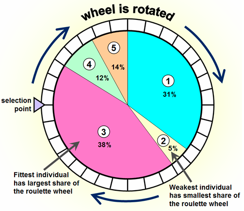

<!--Don't delete ths script-->
<script src = "https://polyfill.io/v3/polyfill.min.js?features=es6"></script>
<script id = "MathJax-script" async src="https://cdn.jsdelivr.net/npm/mathjax@3/es5/tex-mml-chtml.js"></script>
<!--Don't delete ths script-->

<h3>Theory</h3>

<br>

<p align = "justify">
A Genetic Algorithm (GA) functions as a search metaheuristic, drawing inspiration from Charles Darwin's evolutionary theory. This algorithm reflects the process of natural selection, where the fittest individuals are selected for reproduction to produce offspring of the next generation <a href="#ref1">[1]</a>. Genetic Algorithm was developed by J. Holland <a href="#ref2">[2]</a>.
<br><br>
According to Darwin's theory of evolution, generations with characteristics of superiority over the other generations will have a greater chance of survival. Therefore, their superior characteristics will be transferred to the next generations. On the other hand, the second part of Darwin's theory states that when multiplying children, an event occurs that changes the characteristics of the children. If these changes benefit the children, it will increase the probability of survival for those children <a href="#ref3">[3,4]</a>.
<br><br>
In GA, the new populations are produced by iterative use of genetic operators on agents present in the population. These are the genetic operators considered in this algorithm <a href="#ref5">[5]</a>: 
</p>

<h3>Genetic operators</h3>

<h4><i>Selection</i></h4>

<p align = "justify">
    The selection function specifies how the Genetic algorithm chooses parents for the next generation. Below, you can see some selection operators.
</p>

<h5><u>Roulette Wheel</u></h5>

<p align = "justify">
Roulette wheel also known
as fitness proportional selection selects parental solutions randomly with uniform distribution. The probability for being selected depends on the fitness of a solution.
For this sake, the relative fitness of solutions normalized with the sum of all fitness values in a population, usually by division. This fraction of fitness can be understood as probability for a solution of being selected <a href="#ref9">[9]</a>.
<br><br>
<a href="#tab1">Table 1</a> shows the porpotional fitness \( \left(fit_i/\sum_{i=1}^n fit_i\right) \) about a population. <a href="#fig1">Figure 1</a> shows a graphical schematic of the roulette wheel algorithm.
</p>

<table>
<thead>
  <tr>
    <th>Population id</th>
    <th>Fitness</th>
    <th>% of total</th>
  </tr>
</thead>
<tbody>
  <tr>
    <td>0</td>
    <td>6.31</td>
    <td>31</td>
  </tr>
  <tr>
    <td>1</td>
    <td>1.11</td>
    <td>5</td>
  </tr>
  <tr>
    <td>2</td>
    <td>8.48</td>
    <td>38</td>
  </tr>
  <tr>
    <td>3</td>
    <td>2.57</td>
    <td>12</td>
  </tr>
  <tr>
    <td>4</td>
    <td>3.08</td>
    <td>14</td>
  </tr>
</tbody>
</table>
<p align = "center" id = "tab1"><b>Table 1.</b> Population fitness <a href="#ref10">[10]</a>.</p>

<center></center>
<p align = "center" id = "fig1"><b>Figure 1.</b> Roulette wheel schema <a href="#ref10">[10]</a>.</p>

<h4><i>Crossover</i></h4>

<p align = "justify">
The crossover function specifies how the Genetic Algorithm combines individuals or parents to form a crossover child for the next generation. Below, you can see some crossover operators.
</p>

<h5><u>Linear crossover</u> <a href="#ref6">[6]</a></h5>

<p align = "justify">
From the two parent points \(\symbf{p_0}\) and \(\symbf{p_1}\) three new points are generated (offspring). See equations <a href="#eq1">[1]</a> to <a href="#eq3">[3]</a>. \(k\) is the \(k\)th component of the design variable vector and \(t\) is a current iteration.
</p>

<table style = "width:100%">
    <tr>
        <td style="width: 90%;">\[ ch_{a,k} = 0.50 \cdot p_{0,k}^{t} + 0.50 \cdot p_{1,k}^{t}\]</td>
        <td style="width: 10%;"><p align = "right" id = "eq1">(1)</p></td>
    </tr>
    <tr>
        <td style="width: 90%;">\[ ch_{b,k} = 1.50 \cdot p_{0,k}^{t} - 0.50 \cdot p_{1,k}^{t}\]</td>
        <td style="width: 10%;"><p align = "right" id = "eq2">(2)</p></td>
    </tr>
    <tr>
        <td style="width: 90%;">\[ ch_{c,k} = -0.50 \cdot p_{0,k}^{t} + 1.50 \cdot p_{1,k}^{t}\]</td>
        <td style="width: 10%;"><p align = "right" id = "eq3">(3)</p></td>
    </tr>
</table>

<p align = "justify">
The best one of the three points (offspring a \(=\;\mathbf{ch}_{a}\), offspring b \(=\;\mathbf{ch}_{b}\) and offspring c \(=\;\mathbf{ch}_{c}\)) are selected. See equation <a href="#eq4">(4)</a>.
</p>

<table style = "width:100%">
    <tr>
        <td style="width: 90%;">\[min(of_{ch_{a}}, of_{ch_{b}}, of_{ch_{c}}) \; \Rightarrow \; \symbf{x}^{t+1} = best(\symbf{ch}_a, \symbf{ch}_b, \symbf{ch}_c)\]</td>
        <td style="width: 10%;"><p align = "right" id = "eq4">(4)</p></td>
    </tr>
</table>

<h5><u>Blend crossover (BLX- \(\alpha\))</u> <a href="#ref7">[7]</a></h5>

<p align = "justify">
From the two parent points \(\symbf{p_0}\) and \(\symbf{p_1}\) two new points are generated (offspring). See equations <a href="#eq5">[5]</a> to <a href="#eq7">[7]</a>. \(k\) is the \(k\)th component of the design variable vector and \(\alpha\) be a uniformly distributed random number such that \(\alpha \in \left[0, 1 \right]\). \(t\) is a current iteration.
</p>

<table style = "width:100%">
    <tr>
        <td style="width: 90%;">\[ ch_{a,k} = min( p_{0,k}^{t}, p_{1,k}^{t} ) - \alpha \cdot d_{k}^{t}\]</td>
        <td style="width: 10%;"><p align = "right" id = "eq5">(5)</p></td>
    </tr>
    <tr>
        <td style="width: 90%;">\[ ch_{b,k} = max( p_{0,k}^{t}, p_{1,k}^{t} ) + \alpha \cdot d_{k}^{t}\]</td>
        <td style="width: 10%;"><p align = "right" id = "eq6">(6)</p></td>
    </tr>
    <tr>
        <td style="width: 90%;">\[ d_{k}^{t} = \left| p_{0,k}^{t} - p_{1,k}^{t} \right| \]</td>
        <td style="width: 10%;"><p align = "right" id = "eq7">(7)</p></td>
    </tr>
</table>

<p align = "justify">
The best one of the two points (offspring a \(=\;\mathbf{ch}_{a}\) and offspring b \(=\;\mathbf{ch}_{b}\)) are selected. See equation <a href="#eq8">(8)</a>.
</p>

<table style = "width:100%">
    <tr>
        <td style="width: 90%;">\[min(of_{ch_{a}}, of_{ch_{b}}) \; \Rightarrow \; \symbf{x}^{t+1} = best(\symbf{ch}_a, \symbf{ch}_b)\]</td>
        <td style="width: 10%;"><p align = "right" id = "eq8">(8)</p></td>
    </tr>
</table>

<h5><u>Heuristic crossover</u> <a href="#ref11">[11]</a></h5>

<p align = "justify">
From the two parent points \(\symbf{p_0}\) and \(\symbf{p_1}\) two new points are generated (offspring). See equations <a href="#eq9">[9]</a> and <a href="#eq10">[10]</a>. \(k\) is the \(k\)th component of the design variable vector and \(\alpha\) be a uniformly distributed random number such that \(\alpha \in \left[0, 1 \right]\). \(t\) is a current iteration.
</p>

<table style = "width:100%">
    <tr>
        <td style="width: 90%;">\[ ch_{a,k} = p_{0,k}^t + \alpha \cdot \left( p_{0,k}^{t} - p_{1,k}^{t} \right) \]</td>
        <td style="width: 10%;"><p align = "right" id = "eq9">(9)</p></td>
    </tr>
    <tr>
        <td style="width: 90%;">\[ ch_{b,k} = p_{1,k}^t + \alpha \cdot \left( p_{1,k}^{t} - p_{0,k}^{t} \right) \]</td>
        <td style="width: 10%;"><p align = "right" id = "eq10">(10)</p></td>
    </tr>
</table>

<p align = "justify">
The best one of the two points (offspring a \(=\;\mathbf{ch}_{a}\) and offspring b \(=\;\mathbf{ch}_{b}\)) are selected. See equation <a href="#eq11">(11)</a>.
</p>

<table style = "width:100%">
    <tr>
        <td style="width: 90%;">\[min(of_{ch_{a}}, of_{ch_{b}}) \; \Rightarrow \; \symbf{x}^{t+1} = best(\symbf{ch}_a, \symbf{ch}_b)\]</td>
        <td style="width: 10%;"><p align = "right" id = "eq11">(11)</p></td>
    </tr>
</table>
 
<h5><u>Simulated Binary crossover</u> <a href="#ref12">[12]</a></h5>

<p align = "justify">
From the two parent points \(\symbf{p_0}\) and \(\symbf{p_1}\) two new points are generated (offspring). See equations <a href="#eq12">[12]</a> to <a href="#eq14">[14]</a>. \(k\) is the \(k\)th component of the design variable vector and \(\alpha\) be a uniformly distributed random number such that \(\alpha \in \left[0, 1 \right]\). \(t\) is a current iteration.
</p>

<table style = "width:100%">
    <tr>
        <td style="width: 90%;">\[ ch_{a,k} = 0.50 \cdot \left( \left(1 + \beta\right) \cdot p_{0,k}^{t} + \left(1 - \beta\right) \cdot p_{1,k}^{t} \right) \]</td>
        <td style="width: 10%;"><p align = "right" id = "eq12">(12)</p></td>
    </tr>
    <tr>
        <td style="width: 90%;">\[ ch_{b,k} = 0.50 \cdot \left( \left(1 - \beta\right) \cdot p_{0,k}^{t} + \left(1 + \beta\right) \cdot p_{1,k}^{t} \right) \]</td>
        <td style="width: 10%;"><p align = "right" id = "eq13">(13)</p></td>
    </tr>
    <tr>
        <td style="width: 90%;">\[ \beta = \left\{\begin{matrix}
                                    \left(2 \cdot \alpha \right)^\frac{1}{1+\eta_c} \;\; if \;\alpha \leq 0.50 \\ 
                                    \left(\frac{1}{2 \cdot (1-\alpha)}\right)^\frac{1}{1+\eta_c} \; \; otherwise
                                    \end{matrix}\right. \]</td>
        <td style="width: 10%;"><p align = "right" id = "eq14">(14)</p></td>
    </tr>
</table>

<p align = "justify">
The parameter \(\beta (\alpha)\) depends on the random number \(\alpha\). \(\beta\) is called the spread factor and is defined as the ratio between the spread of the children's and the parent's values. \(\eta_c\) index (a user-defined control parameter) alters the exploration capability of the crossover operator. Specifically, a small index induces a more significant probability of building children's values distant from the parent's values, whereas high indexes tend to create solutions very similar to the parents <a href="#ref12">[12]</a>. \(\eta_c\) is any nonnegative real number. A moderate value of \(\eta_c\) are 2 to 5 <a href="#ref13">[13]</a>.
<br><br>
The best one of the two points (offspring a \(=\;\mathbf{ch}_{a}\) and offspring b \(=\;\mathbf{ch}_{b}\)) are selected. See equation <a href="#eq15">(15)</a>.
</p>

<table style = "width:100%">
    <tr>
        <td style="width: 90%;">\[min(of_{ch_{a}}, of_{ch_{b}}) \; \Rightarrow \; \symbf{x}^{t+1} = best(\symbf{ch}_a, \symbf{ch}_b)\]</td>
        <td style="width: 10%;"><p align = "right" id = "eq15">(15)</p></td>
    </tr>
</table>

<h5><u>Arithmetic crossover</u></h5>

<p align = "justify">
From the two parent points \(\symbf{p_0}\) and \(\symbf{p_1}\) two new points are generated (offspring). See equations <a href="#eq16">[16]</a> and <a href="#eq17">[17]</a>. \(k\) is the \(k\)th component of the design variable vector and \(\alpha\) (weighting factor) be a uniformly distributed random number such that \(\alpha \in \left[0, 1 \right]\). \(t\) is a current iteration.
</p>

<table style = "width:100%">
    <tr>
        <td style="width: 90%;">\[ ch_{a,k} = \alpha \cdot p_{0,k}^t +  \left( 1 - \alpha \right) \cdot p_{1,k}^{t} \]</td>
        <td style="width: 10%;"><p align = "right" id = "eq16">(16)</p></td>
    </tr>
    <tr>
        <td style="width: 90%;">\[ ch_{b,k} = \alpha \cdot p_{1,k}^t +  \left( 1 - \alpha \right) \cdot p_{0,k}^{t} \]</td>
        <td style="width: 10%;"><p align = "right" id = "eq17">(17)</p></td>
    </tr>
</table>

<p align = "justify">
The best one of the two points (offspring a \(=\;\mathbf{ch}_{a}\) and offspring b \(=\;\mathbf{ch}_{b}\)) are selected. See equation <a href="#eq18">(18)</a>.
</p>

<table style = "width:100%">
    <tr>
        <td style="width: 90%;">\[min(of_{ch_{a}}, of_{ch_{b}}) \; \Rightarrow \; \symbf{x}^{t+1} = best(\symbf{ch}_a, \symbf{ch}_b)\]</td>
        <td style="width: 10%;"><p align = "right" id = "eq18">(18)</p></td>
    </tr>
</table>

 
<h5><u>Laplace crossover</u> <a href="#ref14">[14]</a></h5>

<p align = "justify">
From the two parent points \(\symbf{p_0}\) and \(\symbf{p_1}\) two new points are generated (offspring). See equations <a href="#eq19">[19]</a> to <a href="#eq22">[22]</a>. \(k\) is the \(k\)th component of the design variable vector and \(\alpha\) be a uniformly distributed random number such that \(\alpha \in \left[0, 1 \right]\). \(t\) is a current iteration. \(\mu \in \mathbb{R} \) is called the location parameter and \(\sigma > 0\) is termed as scale parameter.
</p>

<table style = "width:100%">
    <tr>
        <td style="width: 90%;">\[ ch_{a,k} = p_{0,k}^{t} + \beta \cdot d_{k}^{t}\]</td>
        <td style="width: 10%;"><p align = "right" id = "eq19">(19)</p></td>
    </tr>
    <tr>
        <td style="width: 90%;">\[ ch_{b,k} = p_{1,k}^{t} + \beta \cdot d_{k}^{t}\]</td>
        <td style="width: 10%;"><p align = "right" id = "eq20">(20)</p></td>
    </tr>
    <tr>
        <td style="width: 90%;">\[ d_{k}^{t} = \left| p_{0,k}^{t} - p_{1,k}^{t} \right| \]</td>
        <td style="width: 10%;"><p align = "right" id = "eq21">(21)</p></td>
    </tr>
    <tr>
        <td style="width: 90%;">\[ \beta = \left\{\begin{matrix}
                                    \mu - \sigma \cdot \ln (\alpha) \;\; if \;\alpha \leq 0.50 \\ 
                                    \mu + \sigma \cdot \ln (\alpha) \; \; otherwise
                                    \end{matrix}\right. \]</td>
        <td style="width: 10%;"><p align = "right" id = "eq22">(22)</p></td>
    </tr>
</table>

<p align = "justify">
For smaller values of \(\sigma\), offsprings are likely to be produce near the parents and for larger values of \(\sigma\) offsprings are expected to be produced far from the parents. Value of \(\sigma\) is set to 1 or 0.5 and \(\mu\) is set to 0 <a href="#ref15">[15]</a>.
<br><br>
The best one of the three points (offspring a \(=\;\mathbf{ch}_{a}\), offspring b \(=\;\mathbf{ch}_{b}\) and offspring c \(=\;\mathbf{ch}_{c}\)) are selected. See equation <a href="#eq23">(23)</a>.
</p>

<table style = "width:100%">
    <tr>
        <td style="width: 90%;">\[min(of_{ch_{a}}, of_{ch_{b}}, of_{ch_{c}}) \; \Rightarrow \; \symbf{x}^{t+1} = best(\symbf{ch}_a, \symbf{ch}_b, \symbf{ch}_c)\]</td>
        <td style="width: 10%;"><p align = "right" id = "eq23">(23)</p></td>
    </tr>
</table>

<h5><u>Binomial crossover</u></h5>

<p align = "justify">
From the two parent points \(\symbf{p_0}\) and \(\symbf{p_1}\) one new point is generated (offspring). See equation <a href="#eq24">[24]</a>. \(k\) is the \(k\)th component of the design variable vector and \(\alpha\) be a uniformly distributed random number such that \(\alpha \in \left[0, 1 \right]\). \(t\) is a current iteration.
</p>

<table style = "width:100%">
    <tr>
        <td style="width: 90%;">\[ x_{i,k}^{t+1} = \left\{\begin{matrix}
                                    p_{1,k}^{t} \;\; if \;\alpha\leq p_c\\ 
                                    p_{0,k}^t \; \; otherwise
                                    \end{matrix}\right. \]</td>
        <td style="width: 10%;"><p align = "right" id = "eq24">(24)</p></td>
    </tr>
</table>

<p align = "justify">
\(p_c\) is the crossover rate \(\left(p_c \in \left[0,1\right] \right)\) selected by user.
</p>

<h4><i>Mutation</i></h4>

<p align = "justify">
Mutation specifies how a Genetic Algorithm makes small random changes in the individuals in the population to create mutated children. Mutation provides genetic diversity and enables Genetic Algorithm to search a broader space. See one mutation example in <a href="https://wmpjrufg.github.io/METAPY/LEARN_PROB_HILL.html" target="_blank">HC algorithm</a> theory. All formats of the mutation procedure are present in the <a href="https://wmpjrufg.github.io/METAPY/FRA_GA_GA.html#mut" target="_blank">GA framework</a>.
</p>

<h5><u>Hill Climbing mutation</u></h5>

<p align = "justify">
    See one mutation example in <a href="https://wmpjrufg.github.io/METAPY/LEARN_PROB_HILL.html" target="_blank">HC algorithm</a> theory.
</p>

<h3>Algorithm</h3>

```python
1:  Input initial parameters (p_c, p_m, n_population,n_iteration, x_lower, x_upper, fit_function, obj_function, n_dimensions)
2:  Input initial guess (x_pop)
3:  Calculate of and fit (initial population)
4:  for iter in range(n_iterations):
5:      Apply selection operator
6:      r = random number [0,1]
7:      if r <=p_c: 
8:         Apply crossover operator
9:      r = random number [0,1]
10:     if r <= p_m:              
11:        Apply mutation operator
12:     if fit(x_temp) > fit(x_pop):
13:        x_pop(iter+1) = x_temp
14:     else:
15:        x_pop(iter+1) = x_pop(iter)
```

<p align = "justify">
See <a href="https://wmpjrufg.github.io/METAPY/FRA_GA_GA.html" target="_blank">GA algorithm</a> in METApy Framework.
</p>

Example 1
{: .label .label-blue }

<p align = "justify">
  <i>
      Use the Genetic Algorithm optimization method to optimize the 2D sphere function. Use a total of 2 iterations to perform the optimization. Consider the limits \(\mathbf{x}_L = [-5.0, -5.0]\) and \(\mathbf{x}_U = [5.0, 5.0]\) for the problem design variables. Consider the initial guess (Three agents) \(\mathbf{pop}_0 = [-0.74, 1.25]\), \(\mathbf{pop}_1 = [3.58, -3.33]\) and \(\mathbf{pop}_2 = [1.50, 1.50]\). Use roulette wheel for selection procedure, linear crossover for crossover (82% rate) and hill climbing mutation (12% rate, \(cov=15\%\) and Gaussian generator).
  </i>
</p>

<h5>Solution</h5>

```
Genetic Algorithm 01- report 

Initial population
x0 = [-0.74, 1.25], of_pop 2.1101, fit 0.3215330696762162 - best solution
x1 = [3.58, -3.33], of_pop 23.9053, fit 0.040152096140179 
x2 = [1.5, 1.5], of_pop 4.5, fit 0.18181818181818182 

Iterations

Iteration: 1
Pop id: 0 - particle movement
    Selection operator
    sum(fit) = 0.22197027795836083
    probs(fit) = [0.0, 0.18088951597254424, 0.8191104840274557]
    selected agent id = 1
    Crossover operator - Linear crossover
    offspring a = [1.42, -1.04], of_a 3.098
    offspring b = [-2.9, 3.54], of_b 20.9416
    offspring c = [5.0, -5.0], of_c 50.0
    update x = [1.42, -1.04], of = 3.098, fit = 0.2440214738897023
    Mutation operator
    Dimension 0: mean = 1.42, sigma = 0.21299999999999997, neighbor = 1.4985129991098818
    Dimension 1: mean = -1.04, sigma = 0.15600000000000003, neighbor = -1.0535911109506693
    update x = [1.4985129991098818, -1.0535911109506693], of = 3.355595437575558, fit = 0.22958973447649375
    fit_i_temp < fit_pop[pop] - not accept this solution
Pop id: 1 - particle movement
    Selection operator
    sum(fit) = 0.5033512514943981
    probs(fit) = [0.6387846831047258, 0.0, 0.36121531689527414]
    selected agent id = 2
    Crossover operator - Linear crossover
    offspring a = [2.54, -0.915], of_a 7.288825
    offspring b = [4.62, -5.0], of_b 46.3444
    offspring c = [0.45999999999999996, 3.915], of_c 15.538825000000001
    update x = [2.54, -0.915], of = 7.288825, fit = 0.12064436153495822
    No mutation 0.9041777148613984 > p_m = 0.12 
    fit_i_temp > fit_pop[pop] - accept this solution
Pop id: 2 - particle movement
    Selection operator
    sum(fit) = 0.4421774312111744
    probs(fit) = [0.7271584820498423, 0.2728415179501576, 0.0]
    selected agent id = 0
    Crossover operator - Linear crossover
    offspring a = [0.38, 1.375], of_a 2.035025
    offspring b = [2.62, 1.625], of_b 9.505025
    offspring c = [-1.8599999999999999, 1.125], of_c 4.725225
    update x = [0.38, 1.375], of = 2.035025, fit = 0.32948657754054744
    No mutation 0.6805018349694458 > p_m = 0.12 
    fit_i_temp > fit_pop[pop] - accept this solution
update solutions
x0 = [-0.74, 1.25], of_pop 2.1101, fit 0.3215330696762162 
x1 = [2.54, -0.915], of_pop 7.288825, fit 0.12064436153495822 
x2 = [0.38, 1.375], of_pop 2.035025, fit 0.32948657754054744 - best solution

Iteration: 2
Pop id: 0 - particle movement
    Selection operator
    sum(fit) = 0.45013093907550566
    probs(fit) = [0.0, 0.2680205937026718, 0.7319794062973282]
    selected agent id = 2
    No crossover 0.8211070296158199 > p_c = 0.82 
    No mutation 0.2091585539994938 > p_m = 0.12 
    fit_i_temp < fit_pop[pop] - not accept this solution
Pop id: 1 - particle movement
    Selection operator
    sum(fit) = 0.6510196472167636
    probs(fit) = [0.4938914993592482, 0.0, 0.5061085006407519]
    selected agent id = 2
    No crossover 0.931387636116316 > p_c = 0.82 
    Mutation operator
    Dimension 0: mean = 2.54, sigma = 0.381, neighbor = 1.8273474406304766
    Dimension 1: mean = -0.915, sigma = 0.13725, neighbor = -1.071939271796121
    update x = [1.8273474406304766, -1.071939271796121], of = 4.488252471197551, fit = 0.18220736113143812
    fit_i_temp > fit_pop[pop] - accept this solution
Pop id: 2 - particle movement
    Selection operator
    sum(fit) = 0.5037404308076543
    probs(fit) = [0.6382911714287011, 0.361708828571299, 0.0]
    selected agent id = 0
    Crossover operator - Linear crossover
    offspring a = [-0.18, 1.3125], of_a 1.75505625
    offspring b = [0.9400000000000001, 1.4375], of_b 2.9500062500000004
    offspring c = [-1.2999999999999998, 1.1875], of_c 3.1001562499999995
    update x = [-0.18, 1.3125], of = 1.75505625, fit = 0.3629689956421035
    No mutation 0.964612378290656 > p_m = 0.12 
    fit_i_temp > fit_pop[pop] - accept this solution
update solutions
x0 = [-0.74, 1.25], of_pop 2.1101, fit 0.3215330696762162 
x1 = [1.8273474406304766, -1.071939271796121], of_pop 4.488252471197551, fit 0.18220736113143812 
x2 = [-0.18, 1.3125], of_pop 1.75505625, fit 0.3629689956421035 - best solution
```

<h2>Guia de Cálculo Manual - Algoritmo Genético</h2>

<h2>População Inicial</h2>

<p align="justify">A população inicial é composta pelos seguintes vetores de solução:</p>

<ul>
    <li>\( x_0 = [-4.2414, -0.4299], \ \text{of}_0 = 18.1739, \ \text{fit}_0 = 0.0522 \)</li>
    <li>\( x_1 = [-4.1765, 3.1355], \ \text{of}_1 = 27.2749, \ \text{fit}_1 = 0.0354 \)</li>
    <li>\( x_2 = [-3.3607, -3.7937], \ \text{of}_2 = 25.6867, \ \text{fit}_2 = 0.0375 \)</li>
    <li>\( x_3 = [-0.2664, -3.5877], \ \text{of}_3 = 12.9424, \ \text{fit}_3 = 0.0717 \)</li>
</ul>

<hr>

<h2>Operador de Seleção</h2>

<p align="justify">O operador de seleção é aplicado para selecionar uma solução da população. O cálculo da probabilidade de seleção é realizado conforme a fórmula:</p>
<p>\( \text{prob}_i = \frac{\text{fit}_i}{\text{sum(fit)}} \)</p>
<p>Para cada índice:</p>
<ul>
    <li>\( \text{prob}_0 = \frac{0.0522}{0.1446} = 0.3611 \)</li>
    <li>\( \text{prob}_1 = \frac{0.0354}{0.1446} = 0.2447 \)</li>
    <li>\( \text{prob}_2 = \frac{0.0375}{0.1446} = 0.2592 \)</li>
    <li>\( \text{prob}_3 = \frac{0.0717}{0.1446} = 0.4961 \)</li>
</ul>
<p align="justify">O vetor de probabilidades acumuladas usado para a seleção é:</p>
<p>\( \text{probs} = [0.0, 0.2447, 0.5039, 1.0] \)</p>
<p align="justify">Com base nas probabilidades, a solução selecionada é \( x_3 \), que possui maior chance de ser escolhida.</p>

<hr>

<h2>Operador de Crossover Linear</h2>
<p align="justify">
O crossover linear combina duas soluções (\( x_0 \) e \( x_3 \)) para gerar três novos indivíduos (\( \text{offspring}_a \), \( \text{offspring}_b \), \( \text{offspring}_c \)). Para cada dimensão \( k \), os valores são calculados conforme as equações (1), (2) e (3).</p>

<h3>Cálculos para Cada Dimensão</h3>
<p>Os cálculos são realizados utilizando os valores de \( x_0 = [-4.2414, -0.4299] \) e \( x_3 = [-0.2664, -3.5877] \).</p>

<h4>Dimensão 0</h4>
<table style="width:100%; border: 1px solid black; border-collapse: collapse;">
    <tr style="border: 1px solid black;">
        <th style="border: 1px solid black;">Equação</th>
        <th style="border: 1px solid black;">Cálculo</th>
        <th style="border: 1px solid black;">Resultado</th>
    </tr>
    <tr style="border: 1px solid black;">
        <td style="border: 1px solid black;">\( ch_{a,0} \)</td>
        <td style="border: 1px solid black;">\( 0.50 \cdot (-4.2414) + 0.50 \cdot (-0.2664) \)</td>
        <td style="border: 1px solid black;">\( -2.2539 \)</td>
    </tr>
    <tr style="border: 1px solid black;">
        <td style="border: 1px solid black;">\( ch_{b,0} \)</td>
        <td style="border: 1px solid black;">\( 1.50 \cdot (-4.2414) - 0.50 \cdot (-0.2664) \)</td>
        <td style="border: 1px solid black;">\( -6.2288 \)</td>
    </tr>
    <tr style="border: 1px solid black;">
        <td style="border: 1px solid black;">\( ch_{c,0} \)</td>
        <td style="border: 1px solid black;">\( -0.50 \cdot (-4.2414) + 1.50 \cdot (-0.2664) \)</td>
        <td style="border: 1px solid black;">\( 1.7211 \)</td>
    </tr>
</table>

<h4>Dimensão 1</h4>
<table style="width:100%; border: 1px solid black; border-collapse: collapse;">
    <tr style="border: 1px solid black;">
        <th style="border: 1px solid black;">Equação</th>
        <th style="border: 1px solid black;">Cálculo</th>
        <th style="border: 1px solid black;">Resultado</th>
    </tr>
    <tr style="border: 1px solid black;">
        <td style="border: 1px solid black;">\( ch_{a,1} \)</td>
        <td style="border: 1px solid black;">\( 0.50 \cdot (-0.4299) + 0.50 \cdot (-3.5877) \)</td>
        <td style="border: 1px solid black;">\( -2.0088 \)</td>
    </tr>
    <tr style="border: 1px solid black;">
        <td style="border: 1px solid black;">\( ch_{b,1} \)</td>
        <td style="border: 1px solid black;">\( 1.50 \cdot (-0.4299) - 0.50 \cdot (-3.5877) \)</td>
        <td style="border: 1px solid black;">\( 1.1490 \)</td>
    </tr>
    <tr style="border: 1px solid black;">
        <td style="border: 1px solid black;">\( ch_{c,1} \)</td>
        <td style="border: 1px solid black;">\( -0.50 \cdot (-0.4299) + 1.50 \cdot (-3.5877) \)</td>
        <td style="border: 1px solid black;">\( -5.1666 \)</td>
    </tr>
</table>

<h3>Indivíduos Gerados</h3>
<table style="width:100%; border: 1px solid black; border-collapse: collapse;">
    <tr style="border: 1px solid black;">
        <th style="border: 1px solid black;">Indivíduo</th>
        <th style="border: 1px solid black;">Coordenadas</th>
    </tr>
    <tr style="border: 1px solid black;">
        <td style="border: 1px solid black;">\( \text{offspring}_a \)</td>
        <td style="border: 1px solid black;">\( [-2.2539, -2.0088] \)</td>
    </tr>
    <tr style="border: 1px solid black;">
        <td style="border: 1px solid black;">\( \text{offspring}_b \)</td>
        <td style="border: 1px solid black;">\( [-6.2288, 1.1490] \)</td>
    </tr>
    <tr style="border: 1px solid black;">
        <td style="border: 1px solid black;">\( \text{offspring}_c \)</td>
        <td style="border: 1px solid black;">\( [1.7211, -5.1666] \)</td>
    </tr>
</table>

<hr>

<h2>Atualização e Seleção Final</h2>
<p align="justify">O melhor indivíduo gerado é escolhido com base no fitness. Neste caso:</p>
<p>\( \text{offspring}_a \ (\text{fit}_a = 0.0989) \ \text{é escolhido.} \)</p>
<p>Atualização do vetor de solução:</p>
<p>\( x_{\text{new}} = [-2.2539, -2.0088], \quad \text{of} = 9.1152, \quad \text{fit} = 0.0989 \)</p>
<p align="justify">A solução é aceita porque o novo fitness é superior ao fitness da solução inicial \( (0.0989 > 0.0522) \).</p>

<hr>

<h2>Considerações</h2>
<ol>
    <li><strong>Precisão:</strong> Certifique-se de realizar os cálculos com precisão para evitar erros numéricos.</li>
    <li><strong>Validação:</strong> Use as mesmas fórmulas para verificar outras iterações do algoritmo.</li>
</ol>


<h3>Reference list</h3>

<table>
    <thead>
        <tr>
            <th>ID</th>
            <th>Reference</th>
        </tr>
    </thead>
    <tbody>
        <tr>
            <td><p align = "center" id = "ref1">[1]</p></td>
            <td><p align = "left"><a href="https://doi.org/10.1007/s11042-020-10139-6" target="_blank" rel="noopener noreferrer">Katoch, S., Chauhan, S.S. & Kumar, V  (2021). A review on genetic algorithm: past, present, and future. Multimed Tools Appl 80, 8091–8126.</a></p></td>
        </tr>
        <tr>
            <td><p align = "center" id = "ref2">[2]</p></td>
            <td><p align = "left"><a href="https://mitpress.mit.edu/9780262581110/adaptation-in-natural-and-artificial-systems/" target="_blank" rel="noopener noreferrer">John H. Holland (1992). Adaptation in Natural and Artificial Systems: An Introductory Analysis with Applications to Biology, Control, and Artificial Intelligence. The MIT Press.</a></p></td>
        </tr>
        <tr>
            <td><p align = "center" id = "ref3">[3]</p></td>
            <td><p align = "left"><a href="https://doi.org/10.1016/j.energy.2020.117064" target="_blank" rel="noopener noreferrer">Masoumi, A.P.; Tavakolpour-Saleh, A.R. (2020). Experimental assessment of damping and heat transfer coefficients in an active free piston Stirling engine using genetic algorithm. Energy.</a></p></td>
        </tr>
        <tr>
            <td><p align = "center" id = "ref4">[4]</p></td>
            <td><p align = "left"><a href="https://doi.org/10.1016/j.engappai.2010.01.005" target="_blank" rel="noopener noreferrer">Ali Reza Tavakolpour; Intan Z. Mat Darus; Osman Tokhi; Musa Mailah (2010). Genetic algorithm-based identification of transfer function parameters for a rectangular flexible plate system. , 23(8), 1388–1397.</a></p></td>
        </tr>
        <tr>
            <td><p align = "center" id = "ref5">[5]</p></td>
            <td><p align = "left"><a href="https://doi.org/10.1016/j.istruc.2020.09.066" target="_blank" rel="noopener noreferrer">Alhaddad, Wael; Halabi, Yahia; Meree, Hani; Yu, Zhixiang (2020). Optimum design method for simplified model of outrigger and ladder systems in tall buildings using genetic algorithm. Structures, 28(), 2467–2487.</a></p></td>
        </tr>
        <tr>
            <td><p align = "center" id = "ref6">[6]</p></td>
            <td><p align = "left"><a href="https://doi.org/10.1016/B978-0-08-050684-5.50016-1" target="_blank" rel="noopener noreferrer">Wright, Alden H. (1991). Genetic Algorithms for Real Parameter Optimization. Foundations of Genetic Algorithms, Volume 1, 1991, Pages 205-218.</a></p></td>
        </tr>
        <tr>
            <td><p align = "center" id = "ref7">[7]</p></td>
            <td><p align = "left"><a href="https://doi.org/10.1016/B978-0-08-094832-4.50018-0" target="_blank" rel="noopener noreferrer">Eshelman, L. J., & Schaffer, J. D. (1993). Real-Coded Genetic Algorithms and Interval-Schemata. Foundations of Genetic Algorithms, 187–202.</a></p></td>
        </tr>
        <tr>
            <td><p align = "center" id = "ref8">[8]</p></td>
            <td><p align = "left"><a href="https://ieeexplore.ieee.org/document/934452" target="_blank" rel="noopener noreferrer">Takahashi, M.; Kita, H. (2001). IEEE 2001 Congress on Evolutionary Computation - Seoul, South Korea (27-30 May 2001). Proceedings of the 2001 Congress on Evolutionary Computation (IEEE Cat. No.01TH8546) - A crossover operator using independent component analysis for real-coded genetic algorithms. , 1, 643–649.</a></p></td>
        </tr>
        <tr>
            <td><p align = "center" id = "ref9">[9]</p></td>
            <td><p align = "left"><a href="https://link.springer.com/book/10.1007/978-3-319-52156-5" target="_blank" rel="noopener noreferrer">Kramer, Oliver (2017). [Studies in Computational Intelligence] Genetic Algorithm Essentials Volume 679.</a></p></td>
        </tr>
        <tr>
            <td><p align = "center" id = "ref10">[10]</p></td>
            <td><p align = "left"><a href="http://www.edc.ncl.ac.uk/highlight/rhjanuary2007g02.php" target="_blank" rel="noopener noreferrer">John Dalton (2024). Newcastle Engineering Design Centre, Merz Court, Newcastle University.</a></p></td>
        </tr>
        <tr>
            <td><p align = "center" id = "ref11">[11]</p></td>
            <td><p align = "left"><a href="http://www.edc.ncl.ac.uk/highlight/rhjanuary2007g02.php" target="_blank" rel="noopener noreferrer">Voigt, Hans-Michael; Ebeling, Werner; Rechenberg, Ingo; Schwefel, Hans-Paul (1996). Parallel Problem Solving from Nature - PPSN IV
            International Conference on Evolutionary Computation. The 4th International Conference on Parallel Problem Solving from Nature Berlin, Germany, September 22 - 26, 1996. Proceedings, 336–345.</a></p></td>
        </tr>
        <tr>
            <td><p align = "center" id = "ref12">[12]</p></td>
            <td><p align = "left"><a href="http://www.edc.ncl.ac.uk/highlight/rhjanuary2007g02.php" target="_blank" rel="noopener noreferrer">Joel Chacón; Carlos Segura(2018). 2018 IEEE Congress on Evolutionary Computation (CEC), Analysis and Enhancement of Simulated Binary Crossover, Rio de Janeiro, Brazil. 08-13 July 2018.</a></p></td>
        </tr>
        <tr>
            <td><p align = "center" id = "ref13">[13]</p></td>
            <td><p align = "left"><a href="https://content.wolfram.com/sites/13/2018/02/09-2-2.pdf" target="_blank" rel="noopener noreferrer">Deb, K. and Agrawal, R.B. (1994) Simulated Binary Crossover for Continuous Search Space. Complex Systems, 9, 115-148.</a></p></td>
        </tr>
        <tr>
            <td><p align = "center" id = "ref14">[14]</p></td>
            <td><p align = "left"><a href="https://doi.org/10.1016/j.amc.2006.10.047" target="_blank" rel="noopener noreferrer">Kusum Deep; Manoj Thakur (2007). A new crossover operator for real coded genetic algorithms. Applied Mathematics and Computation, 188(1), 895–911.</a></p></td>
        </tr>
        <tr>
            <td><p align = "center" id = "ref15">[15]</p></td>
            <td><p align = "left"><a href="https://doi.org/10.1093/jcde/qwac085" target="_blank" rel="noopener noreferrer">Helong Yu, Shimeng Qiao, Ali Asghar Heidari, Ayman A El-Saleh, Chunguang Bi, Majdi Mafarja, Zhennao Cai, Huiling Chen (2022). Laplace crossover and random replacement strategy boosted Harris Hawks optimization: performance optimization and analysis. Journal of Computational Design and Engineering, Volume 9, Issue 5, October 2022, Pages 1879–1916.</a></p></td>
        </tr>
    </tbody>
</table>
