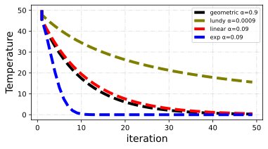

<!--Don't delete ths script-->
<script src = "https://polyfill.io/v3/polyfill.min.js?features=es6"></script>
<script id = "MathJax-script" async src="https://cdn.jsdelivr.net/npm/mathjax@3/es5/tex-mml-chtml.js"></script>
<!--Don't delete ths script-->

<h3>Theory</h3>

<br>

<p align = "justify">
The Simulated Annealing method was introduced by Kirkpatrick et al. <a href="#ref1">[1]</a> in 1983. The annealing process of metals inspires this algorithm during the manufacturing process. The Simulated Annealing model is based on generating random neighbors from a starting point, similar to what occurs in the Hill Climbing Algorithm (see <a href="https://wmpjrufg.github.io/METAPY/LEARN_PROB_HILL.html" target="_blank">HC algorithm</a> theory).
<br><br>
In the Simulated Annealing algorithm, the acceptance of the new solution (see new solution procedure in see <a href="https://wmpjrufg.github.io/METAPY/LEARN_PROB_HILL.html" target="_blank">HC algorithm</a> theory) is given by a criterion that compares the system's energy given by equation <a href="#eq1">(1)</a>. In this algorithm, the values of \(E_{i}\) are relative to the value of the objective function to \(i\) particle (current solution), i.e., \(E_{i}=of_{i}\).
</p>

<table style = "width:100%">
    <tr>
        <td style="width: 90%;">\[\Delta E = E_{new} - E_{cur}\]</td>
        <td style="width: 10%;"><p align = "right" id = "eq1">(1)</p></td>
    </tr>
</table>

<p align = "justify">
The value \(E_{new}\) is the value of the objective function for the newly generated neighbor, and \(E_{cur}\) is the value of the objective function for the current particle. 
<br><br>
The solution will be accepted if \( E_{cur} > E_{new} \left( P(\Delta E,T)=1.00 \right) \). For solutions of type \(E_{cur} < E_{new}\) the acceptance will follow a certain probability given by equation <a href="#eq2">(2)</a> where \(T\) the annealing temperature.
</p>

<table style = "width:100%">
    <tr>
        <td style="width: 90%;">\[P(\Delta E,T) = e^{\frac{-\Delta E}{T}}\]</td>
        <td style="width: 10%;"><p align = "right" id = "eq2">(2)</p></td>
    </tr>
</table>

<p align = "justify" id = "colling">
At the end of the algorithm, the temperature is updated. \(\alpha\) is the cooling temperature adjustment factor. The methods for updating the temperature are (see Figure <a href="#fig01">1</a>):
</p>

<ul>
  <li>Geometric <a href="#ref3">[3]</a>: See equation <a href="#eq3">(3)</a>;</li>
  <li>Lundy <a href="#ref5">[5]</a>: See equation <a href="#eq4">(4)</a>;</li>
  <li>Linear <a href="#ref4">[4]</a>: See equation <a href="#eq5">(5)</a>;</li>
  <li>Exponential <a href="#ref2">[2]</a>: See equation <a href="#eq6">(6)</a>;</li>
</ul>

<table style = "width:100%">
    <tr>
        <td style="width: 90%;">\[T_{i+1} = \alpha \cdot T_{i} \]</td>
        <td style="width: 10%;"><p align = "right" id = "eq3">(3)</p></td>
    </tr>
    <tr>
        <td style="width: 90%;">\[T_{i+1} = \frac{T_{i}}{1+ \alpha \cdot T_{i}}\]</td>
        <td style="width: 10%;"><p align = "right" id = "eq4">(4)</p></td>
    </tr>
    <tr>
        <td style="width: 90%;">\[T_{i+1} = T_{i} - \alpha \cdot T_{i} \]</td>
        <td style="width: 10%;"><p align = "right" id = "eq5">(5)</p></td>
    </tr>
    <tr>
        <td style="width: 90%;">\[T_{i+1} = T_{i} \cdot e^{-\alpha \cdot i}\]</td>
        <td style="width: 10%;"><p align = "right" id = "eq6">(6)</p></td>
    </tr>
</table>

<center></center>
<p align = "center" id = "fig01"><b>Figure 1.</b> Colling schema.</p>

<p align = "justify">
Temperature is a crucial control parameter. Temperature is reduced systematically in SA procedures. Rapid cooling produces irregularities in the crystal structure that do not reach a minimum energy level. In contrast, a very slow cooling scheme provides ideal crystals with minimum attainable energy but may require prohibitive calculation time. Movements of molecules, particularly at high temperatures, are chaotic, and hence, there is a possibility of not reaching the minimum energy for these temperatures. In optimization SA, the mechanism mimics this by allowing acceptation of a worse solution. The probability of such acceptance depends on temperature and should approach zero for low temperatures. A chance of accepting temporarily a worse solution is an important feature of SA strategy. This mechanism should allow
SA algorithm escaping from a local optimum <a href="#ref9">[9]</a>.
</p>

<h3><p align = "justify"  id = "temp">Start temperature</p></h3>

<p align = "justify">
The initial temperature \(T_0\) should be high enough large enough so that nearly all transitions are accepted at the first iterations. The initial probability of acceptance must not be close to one, neither must be close to zero. The probability of accepting a higher-cost solution was set to 0.80 <a href="#ref6">[6,7,8]</a>. The initial temperature is given by equation <a href="#eq7">(7)</a>:
</p>

<table style = "width:100%">
    <tr>
        <td style="width: 90%;">\[T_0 = \frac{-\Delta E^+}{\ln{0.80}}\]</td>
        <td style="width: 10%;"><p align = "right" id = "eq7">(7)</p></td>
    </tr>
</table>

<p align = "justify">
\(\Delta E^+\) represents the energy of strictly positive transitions, i.e. \(\Delta E > 0 \).
</p>

<h3>Algorithm</h3>

```python
1:  Input initial parameters (temp, cov, n_population, x_lower, x_upper, obj_function, n_dimensions)
2:  Input initial guess (x_pop)
3:  Calculate of and fit (initial population)
4:  for iter in range(n_iterations):
5:      x_temp = neighbor solution equation hill climbing
6:      delta_e = equation (1)
7:      if delta_e > 0:
8:         prob = 1
9:      else:
10:        prob = equation (2)
11:     r = random number [0,1]
12:     if r <= prob:
13:        x_pop(iter+1) = x_temp
14:     else:
15:        x_pop(iter+1) = x_pop(iter)
16:     temp_update = equation (3) - (6)
```

{: .note }
> The Simulated Annealing algorithm can accept unfavorable moves. This characteristic depends on temperature and change in objective value ΔE.

<p align = "justify">
See <a href="https://wmpjrufg.github.io/METAPY/FRA_SA_SA.html" target="_blank">SA algorithm</a> in METApy Framework.
</p>

Example 1
{: .label .label-blue }

<p align = "justify">
  <i>
      Use the Simulated Annealing optimization method to optimize the 2D sphere function. Use a total of 2 iterations to perform the optimization. Consider the limits \(\mathbf{x}_L = [-5.0, -5.0]\) and \(\mathbf{x}_U = [5.0, 5.0]\) for the problem design variables. Consider the initial guess (two agents) \(\mathbf{pop}_0 = [-0.74, 1.25]\) and \(\mathbf{pop}_1 = [3.58, -3.33]\). Use \(cov = 20%\), Gaussian random generator, \(T_0 = 15\) and geometric schedule (\(\alpha = 0.90\)).
  </i>
</p>


<h5>Solution</h5>

```
Simulated Annealing 01 - report 

Initial population
x0 = [-0.74, 1.25], of_pop 2.1101 - best solution
x1 = [3.58, -3.33], of_pop 23.9053 

Iterations

Iteration: 1
Temperature: 15
Pop id: 0 - particle movement - mutation procedure
    current x = [-0.74, 1.25]
    Dimension 0: mean = -0.74, sigma = 0.14800000000000002, neighbor = -0.6602162206983541
    Dimension 1: mean = 1.25, sigma = 0.25, neighbor = 1.2137927198636664
    update x = [-0.6602162206983541, 1.2137927198636664], of = 1.9091782248672549, fit = 0.34373968272281763
    energy = -0.20092177513274523, prob. state = 1
    random number=0.154246375420666 <= prob. state=1 - accept this solution
Pop id: 1 - particle movement - mutation procedure
    current x = [3.58, -3.33]
    Dimension 0: mean = 3.58, sigma = 0.716, neighbor = 3.401325017838678
    Dimension 1: mean = -3.33, sigma = 0.6659999999999999, neighbor = -3.4053363365858322
    update x = [3.401325017838678, -3.4053363365858322], of = 23.165327442247097, fit = 0.04138160355533802
    energy = -0.7399725577529033, prob. state = 1
    random number=0.5668852469307849 <= prob. state=1 - accept this solution
update solutions
x0 = [-0.6602162206983541, 1.2137927198636664], of_pop 1.9091782248672549 - best solution
x1 = [3.401325017838678, -3.4053363365858322], of_pop 23.165327442247097 

Iteration: 2
Temperature: 13.5
Pop id: 0 - particle movement - mutation procedure
    current x = [-0.6602162206983541, 1.2137927198636664]
    Dimension 0: mean = -0.6602162206983541, sigma = 0.1320432441396708, neighbor = -0.7783591115824063
    Dimension 1: mean = 1.2137927198636664, sigma = 0.24275854397273328, neighbor = 1.4456134129098128
    update x = [-0.7783591115824063, 1.4456134129098128], of = 2.69564104616811, fit = 0.27058905004772243
    energy = 0.7864628213008551, prob. state = 0.9434079272824024
    random number=0.21250149387436257 <= prob. state=0.9434079272824024 - accept this solution
Pop id: 1 - particle movement - mutation procedure
    current x = [3.401325017838678, -3.4053363365858322]
    Dimension 0: mean = 3.401325017838678, sigma = 0.6802650035677357, neighbor = 5.12575825256521
    Dimension 1: mean = -3.4053363365858322, sigma = 0.6810672673171665, neighbor = -4.378437656968545
    update x = [5.0, -4.378437656968545], of = 44.170716315960206, fit = 0.02213823648500941
    energy = 21.00538887371311, prob. state = 0.21098784972914733
    random number=0.5070777353026081 > prob. state=0.21098784972914733 - not accept this solution
update solutions
x0 = [-0.7783591115824063, 1.4456134129098128], of_pop 2.69564104616811 - best solution
x1 = [3.401325017838678, -3.4053363365858322], of_pop 23.165327442247097 
```
<h2>Simulated Annealing - Guia de Cálculo</h2>

<h2>População Inicial</h2>
<p align="justify">A população inicial é composta pelos seguintes vetores de solução:</p>
<ul>
    <li>\( x_0 = [-0.74, 1.25], \ \text{of}_{\text{pop}} = 2.1101 \) - <strong>melhor solução</strong></li>
    <li>\( x_1 = [3.58, -3.33], \ \text{of}_{\text{pop}} = 23.9053 \)</li>
</ul>

<hr>

<h2>Temperatura Inicial Automática</h2>
<p align="justify">A temperatura inicial é calculada com base nos seguintes parâmetros:</p>
<p>\( \text{sum}_t0 = 24124.992855206798, \quad \text{número de movimentos aceitos} (\Delta E > 0) = 669, \quad t_{\text{mean}} = 36.061274820936916 \)</p>

<hr>

<h2>Iterações</h2>

<h3>Iteração 1</h3>
<p><strong>Temperatura:</strong> 36.061274820936916</p>

<h4>População 0 - Movimento da Partícula - Procedimento de Mutação</h4>
<table style="width:100%; border: 1px solid black; border-collapse: collapse;">
    <tr style="border: 1px solid black;">
        <th style="border: 1px solid black;" colspan="2">Estado Atual</th>
    </tr>
    <tr style="border: 1px solid black;">
        <td style="border: 1px solid black;">\( x \)</td>
        <td style="border: 1px solid black;">\( [-0.74, 1.25] \)</td>
    </tr>
    <tr style="border: 1px solid black;">
        <th style="border: 1px solid black;" colspan="2">Dimensões</th>
    </tr>
    <tr style="border: 1px solid black;">
        <td style="border: 1px solid black;">Dimensão 0 (média, sigma, vizinho)</td>
        <td style="border: 1px solid black;">-0.74, 0.74, -0.8532158618420498</td>
    </tr>
    <tr style="border: 1px solid black;">
        <td style="border: 1px solid black;">Dimensão 1 (média, sigma, vizinho)</td>
        <td style="border: 1px solid black;">1.25, 1.25, 2.255788432175912</td>
    </tr>
    <tr style="border: 1px solid black;">
        <th style="border: 1px solid black;" colspan="2">Novo Vetor de Solução</th>
    </tr>
    <tr style="border: 1px solid black;">
        <td style="border: 1px solid black;">\( x \)</td>
        <td style="border: 1px solid black;">\( [-0.8532158618420498, 2.255788432175912] \)</td>
    </tr>
    <tr style="border: 1px solid black;">
        <td style="border: 1px solid black;">\( \text{of} \)</td>
        <td style="border: 1px solid black;">5.81655875763753</td>
    </tr>
    <tr style="border: 1px solid black;">
        <td style="border: 1px solid black;">\( \text{fit} \)</td>
        <td style="border: 1px solid black;">0.14670158881555334</td>
    </tr>
    <tr style="border: 1px solid black;">
        <th style="border: 1px solid black;" colspan="2">Energia e Probabilidade do Estado</th>
    </tr>
    <tr style="border: 1px solid black;">
        <td style="border: 1px solid black;">Energia</td>
        <td style="border: 1px solid black;">3.70645875763753</td>
    </tr>
    <tr style="border: 1px solid black;">
        <td style="border: 1px solid black;">Probabilidade do Estado</td>
        <td style="border: 1px solid black;">0.9023234381814448</td>
    </tr>
    <tr style="border: 1px solid black;">
        <th style="border: 1px solid black;" colspan="2">Resultado</th>
    </tr>
    <tr style="border: 1px solid black;">
        <td style="border: 1px solid black;" colspan="2">O número aleatório gerado foi 0.4151385894957291, que é menor que a probabilidade do estado (0.9023234381814448), então essa solução é aceita.</td>
    </tr>
</table>

<h4>População 1 - Movimento da Partícula - Procedimento de Mutação</h4>
<table style="width:100%; border: 1px solid black; border-collapse: collapse;">
    <tr style="border: 1px solid black;">
        <th style="border: 1px solid black;" colspan="2">Estado Atual</th>
    </tr>
    <tr style="border: 1px solid black;">
        <td style="border: 1px solid black;">\( x \)</td>
        <td style="border: 1px solid black;">\( [3.58, -3.33] \)</td>
    </tr>
    <tr style="border: 1px solid black;">
        <th style="border: 1px solid black;" colspan="2">Dimensões</th>
    </tr>
    <tr style="border: 1px solid black;">
        <td style="border: 1px solid black;">Dimensão 0 (média, sigma, vizinho)</td>
        <td style="border: 1px solid black;">3.58, 3.58, 3.49792532516269</td>
    </tr>
    <tr style="border: 1px solid black;">
        <td style="border: 1px solid black;">Dimensão 1 (média, sigma, vizinho)</td>
        <td style="border: 1px solid black;">-3.33, 3.33, -3.7698277212656794</td>
    </tr>
    <tr style="border: 1px solid black;">
        <th style="border: 1px solid black;" colspan="2">Novo Vetor de Solução</th>
    </tr>
    <tr style="border: 1px solid black;">
        <td style="border: 1px solid black;">\( x \)</td>
        <td style="border: 1px solid black;">\( [3.49792532516269, -3.7698277212656794] \)</td>
    </tr>
    <tr style="border: 1px solid black;">
        <td style="border: 1px solid black;">\( \text{of} \)</td>
        <td style="border: 1px solid black;">26.4470826284377</td>
    </tr>
    <tr style="border: 1px solid black;">
        <td style="border: 1px solid black;">\( \text{fit} \)</td>
        <td style="border: 1px solid black;">0.03643374465466535</td>
    </tr>
    <tr style="border: 1px solid black;">
        <th style="border: 1px solid black;" colspan="2">Energia e Probabilidade do Estado</th>
    </tr>
    <tr style="border: 1px solid black;">
        <td style="border: 1px solid black;">Energia</td>
        <td style="border: 1px solid black;">2.541782628437698</td>
    </tr>
    <tr style="border: 1px solid black;">
        <td style="border: 1px solid black;">Probabilidade do Estado</td>
        <td style="border: 1px solid black;">0.9319416236325307</td>
    </tr>
    <tr style="border: 1px solid black;">
        <th style="border: 1px solid black;" colspan="2">Resultado</th>
    </tr>
    <tr style="border: 1px solid black;">
        <td style="border: 1px solid black;" colspan="2">O número aleatório gerado foi 0.4789585333955295, que é menor que a probabilidade do estado (0.9319416236325307), então essa solução é aceita.</td>
    </tr>
</table>

<p align="justify">O número aleatório gerado foi 0.4789585333955295, que é menor que a probabilidade do estado (0.9319416236325307), então essa solução também é aceita.</p>

<hr>

<h2>Atualização das Soluções</h2>
<p align="justify">Após a primeira iteração, as soluções foram atualizadas para:</p>
<ul>
    <li>\( x_0 = [-0.8532158618420498, 2.255788432175912], \ \text{of}_{\text{pop}} = 5.81655875763753 \) - <strong>melhor solução</strong></li>
    <li>\( x_1 = [3.49792532516269, -3.7698277212656794], \ \text{of}_{\text{pop}} = 26.4470826284377 \)</li>
</ul>


<h3>Reference list</h3>

<table>
    <thead>
        <tr>
            <th>ID</th>
            <th>Reference</th>
        </tr>
    </thead>
    <tbody>
        <tr>
            <td><p align = "center" id = "ref1">[1]</p></td>
            <td><p align = "left"><a href="https://www.science.org/doi/10.1126/science.220.4598.671" target="_blank" rel="noopener noreferrer">Kirkpatrick, S.; Gelatt, C. D.; Vecchi, M. P. (1983). Optimization by Simulated Annealing. , 220(4598), 671–680.</a></p></td>
        </tr>
        <tr>
            <td><p align = "center" id = "ref2">[2]</p></td>
            <td><p align = "left"><a href="https://doi.org/10.1063/5.0018725" target="_blank" rel="noopener noreferrer">Karabin, M., & Stuart, S. J. (2020). Simulated annealing with adaptive cooling rates. The Journal of Chemical Physics, 153(11).</a></p></td>
        </tr>
        <tr>
            <td><p align = "center" id = "ref3">[3]</p></td>
            <td><p align = "left"><a href="https://www.sciencedirect.com/science/article/abs/pii/S0301420721000337" target="_blank" rel="noopener noreferrer">Abid Ali Khan Danish;Asif Khan;Khan Muhammad;Waqas Ahmad;Saad Salman; (2021). A simulated annealing based approach for open pit mine production scheduling with stockpiling option. Resources Policy.</a></p></td>
        </tr>
        <tr>
            <td><p align = "center" id = "ref4">[4]</p></td>
            <td><p align = "left"><a href="https://www.scirp.org/pdf/AM_2017083014324828.pdf" target="_blank" rel="noopener noreferrer">Peprah, A.K., Appiah, S.K. and Amponsah, S.K. (2017) An Optimal Cooling Schedule Using a Simulated Annealing Based Approach. Applied Mathematics, 8, 1195-1210.</a></p></td>
        </tr>
        <tr>
            <td><p align = "center" id = "ref5">[5]</p></td>
            <td><p align = "left"><a href="https://link.springer.com/article/10.1007/BF01582166" target="_blank" rel="noopener noreferrer">M. Lundy; A. Mees (1986). Convergence of an annealing algorithm. Mathematical Programming, 34(1), 111–124.</a></p></td>
        </tr>
        <tr>
            <td><p align = "center" id = "ref6">[6]</p></td>
            <td><p align = "left"><a href="https://doi.org/10.1007/978-3-319-91086-4_1" target="_blank" rel="noopener noreferrer">Delahaye, D., Chaimatanan, S., Mongeau, M. (2019). Simulated Annealing: From Basics to Applications. In: Gendreau, M., Potvin, JY. (eds) Handbook of Metaheuristics. International Series in Operations Research & Management Science, vol 272. Springer, Cham.</a></p></td>
        </tr>
        <tr>
            <td><p align = "center" id = "ref7">[7]</p></td>
            <td><p align = "left"><a href="https://doi.org/10.1007/978-3-540-24767-8_41" target="_blank" rel="noopener noreferrer">Atiqullah, M.M. (2004). An Efficient Simple Cooling Schedule for Simulated Annealing. In: Laganá, A., Gavrilova, M.L., Kumar, V., Mun, Y., Tan, C.J.K., Gervasi, O. (eds) Computational Science and Its Applications – ICCSA 2004. ICCSA 2004. Lecture Notes in Computer Science, vol 3045. Springer, Berlin, Heidelberg.</a></p></td>
        </tr>
        <tr>
            <td><p align = "center" id = "ref8">[8]</p></td>
            <td><p align = "left"><a href="https://ieeexplore.ieee.org/document/5164685" target="_blank" rel="noopener noreferrer">Shakouri G., H.; Shojaee, Kambiz; Behnam T., M. (2009). [IEEE 2009 17th Mediterranean Conference on Control and Automation (MED) - Thessaloniki, Greece (2009.06.24-2009.06.26)] 2009 17th Mediterranean Conference on Control and Automation - Investigation on the choice of the initial temperature in the Simulated Annealing: A mushy state SA for TSP. 1050–1055.</a></p></td>
        </tr>
        <tr>
            <td><p align = "center" id = "ref9">[9]</p></td>
            <td><p align = "left"><a href="https://doi.org/10.1016/B978-0-08-045141-1.00001-9" target="_blank" rel="noopener noreferrer">Sieniutycz, Stanisław (2018). Energy Optimization in Process Systems and Fuel Cells: Brief review of static optimization methods. 1–41.</a></p></td>
        </tr>
    </tbody>
</table>


