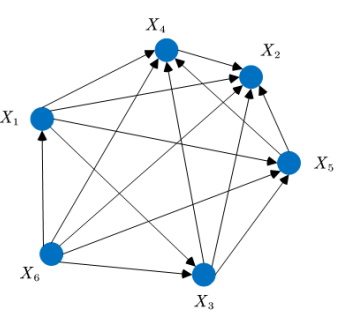

<!--Don't delete ths script-->
<script src = "https://polyfill.io/v3/polyfill.min.js?features=es6"></script>
<script id = "MathJax-script" async src="https://cdn.jsdelivr.net/npm/mathjax@3/es5/tex-mml-chtml.js"></script>
<!--Don't delete ths script-->

<h1>Algoritmo Genético</h1>

<h2>Teoria</h2>

<p align = "justify">
Os Algoritmos Genéticos foram criados nos anos 60 pelo pesquisador John Holland que, ao ter acesso aos estudos do biólogo Fisher acerca da
evolução natural [1], percebeu um elo nítido entre a biologia e a computação: as máquinas poderiam se adaptar ao meio ambiente, assim como os seres vivos.

Os AGs diferem da maioria dos procedimentos de busca e otimização em quatro princípios básicos:
1. AGs podem operar tanto em um espa ̧co de soluções codificadas (espaço de genótipos)
quanto diretamente no espaço de busca (espaço de fenótipos).

2. AGs operam sobre um ou mais conjuntos de pontos (populações de cromossomos),
e não a partir de um ponto isolado, o que os tornam menos propensos a ficarem
presos em pontos que são ótimos locais.

3. AGs não necessitam de conhecimentos auxiliares, al ́em da representação das soluções
e da estimacão da qualidade destas.

4. AGs usam regras de transição probabilísticas e não regras determinísticas.

AGs possuem um ciclo de execução, em AGs típicos esse ciclo executa conforme a figura(1).
</p>


<table style = "width:100%">
    <tr>
        <td>\[\symbf{x}_{i,k}^{t+1} = \symbf{x}_{i,k}^{t} + \symbf{\beta}.(\symbf{x}_{j,k}^{t} - \symbf{x}_{i,k}^{t}) + \alpha.\symbf{sd}_{k}.(\symbf{rand}_{k} - 0.50)\]</td>
        <td><p align = "right">(1)</p></td>
    </tr>
</table>

<p align = "justify">
Where the attractiveness vector (\(\symbf{\beta}\)), corresponding to the attractiveness of the firefly is understood as the degree of light perception that a particle \(i\) has of its peers (\(\symbf{x}_{j}\)), as a function of the Euclidean distance (\(\symbf{r}_{ij}\)) among individuals is provided by the equation (2). \(\beta_0\) is the value for null distance (equation 3). Therefore, a low value of \(\beta\), either due to a large distance or high light absorption by the medium (\(\symbf{\gamma}\)), will affect a model with a greater random character. When \(\beta_0 = 0\) the movement depends on the random walk only [2]. If \(\gamma \rightarrow 0 \), the attractiveness becomes \(\beta = \beta_0\). That is, the attractiveness is constant anywhere within the search space [2]. \(\symbf{x}_{i}^{t}\) is the current solution and \(\symbf{x}_{j}^{t}\) is the current neighbor solution. \(\symbf{x}_{upper}\) is the upper boundary of the variables and \(\symbf{x}_{lower}\) is the lower boundary of the variables. \(t\) is the current iteration of the algorithm. \(\symbf{sd}\) is the scale of each design variable (\(\symbf{x}_{upper}-\symbf{x}_{lower}\)).<br><br>
</p>

<table style = "width:100%">
    <tr>
        <td>\[\symbf{r}_{ij} = \sqrt{\sum_{i=1}^{n_{pop}} \symbf{x}_{ik}^t} - \symbf{x}_{jk}^t\]</td>
        <td><p align = "right">(2)</p></td>
    </tr>
    <tr>
        <td>\[\symbf{\beta} = \frac{\beta_0}{1+\symbf{\gamma} \times \symbf{r}_{ij}^2}\]</td>
        <td><p align = "right">(3)</p></td>
    </tr>
    <tr>
        <td>\[\symbf{\gamma} = \frac{1}{\symbf{sd}^2}\]</td>
        <td><p align = "right">(4)</p></td>
    </tr>
</table>

<p align = "justify">
Considering the random part of equation (1), the term \(\symbf{rand}\) is a vector of random numbers drawn from a uniform distribution at time \(t\) [3]. Therefore, larger values of \(\alpha\) lead to expressive randomness in the generation of populations. Thus, Yang [1] proposes to use some function (see equation 5 to 11) that updates \(\alpha\) along the generations \(t\) in order to change the degree of randomness.
</p>

<table style = "width:100%">
    <tr>
        <td>\[\alpha^{t+1} = \alpha_{min} + (\alpha_{max} - \alpha_{min}).\theta^t, \theta = \in \{0, 1\}\]</td>
        <td><code>'YANG 0'</code> [1]</td>
        <td><p align = "right">(5)</p></td>
    </tr>
    <tr>
        <td>\[\alpha^{t+1} = \alpha_{max}.\theta^t, \theta = \in \{0, 1\}\]</td>
        <td><code>'YANG 1'</code> [1]</td>
        <td><p align = "right">(6)</p></td>
    </tr>
    <tr>
        <td>\[\alpha^{t+1} = \alpha_{max} + (\alpha_{min} - \alpha_{max}).e^{-t}\]</td>
        <td><code>'YANG 2'</code> [1]</td>
        <td><p align = "right">(7)</p></td>
    </tr>
    <tr>
        <td>\[\alpha^{t+1} = \frac{0.40}{1+e^{\frac{t-n_{iter}}{200}}}\]</td>
        <td><code>'YANG 3'</code> [4,5]</td>
        <td><p align = "right">(8)</p></td>
    </tr>
    <tr>
        <td>\[\alpha^{t+1} = \alpha^{t}. 0.99\]</td>
        <td><code>'YANG 4'</code> [5]</td>
        <td><p align = "right">(9)</p></td>
    </tr>
    <tr>
        <td>\[\alpha^{t+1} = \alpha^{t}.\left(1-\frac{t}{n_{iter}}\right)\]</td>
        <td><code>'YANG 5'</code> [7]</td>
        <td><p align = "right">(10)</p></td>
    </tr>
    <tr>
        <td>\[\alpha^{t+1} = \alpha^{t}.\left(\frac{t}{9000}\right)^{\frac{1}{t}}\]</td>
        <td><code>'YANG 6'</code> [5,8]</td>
        <td><p align = "right">(11)</p></td>
    </tr>
</table>

<p align = "justify">In most applications, we can use \(\theta\) = 0.95 ∼ 0.99 [1].</p>

<h3><i>Algorithm</i></h3>

```python
1:  Input initial parameters (GAMMA, ALPHA_MAX, ALPHA_MIN, TETHA)
2:  X = Initial solution
3:  for T in range(N_ITER):
4:      Calculate OF and FIT      
5:      Sort population
6:      X(T+1) = update solution equation (1)
7:      Update alpha
```

<p align = "justify">
\(n_{iter}\) is the maximum number of iterations.
</p>

<p align = "justify">
In standard Firefly, the attraction mechanism used is the full attraction model. See Figure 1.
</p>

<center></center>
<p align = "center">
<b>Figure 1.</b> The full attraction mechanism [6].</p>


<h3><i>References</i></h3>
<p align = "justify">
    [1]	X.-S. Yang, Nature-Inspired Metaheuristic Algorithms, Luniver Press, 2008.<br>
    [2] Fister, I., Fister, I., Yang, X.-S., & Brest, J. (2013). A comprehensive review of firefly algorithms. Swarm and Evolutionary Computation, 13, 34–46. doi:10.1016/j.swevo.2013.06.001. 
    <br>
    [3] X.-S. Yang, Firefly Algorithm, Stochastic Test Functions and Design Optimisation, ArXiv:1003.1409 [Math]. (2010). http://arxiv.org/abs/1003.1409 (accessed September 5, 2019).<br>
    [4] Yu, S., Zhu, S., Ma, Y., & Mao, D. (2015). A variable step size firefly algorithm for numerical optimization. Applied Mathematics and Computation, 263, 214–220. doi:10.1016/j.amc.2015.04.065.<br>
    [5] Wang, H., Cui, Z., Sun, H., Rahnamayan, S., & Yang, X.-S. (2016). Randomly attracted firefly algorithm with neighborhood search and dynamic parameter adjustment mechanism. Soft Computing, 21(18), 5325–5339. doi:10.1007/s00500-016-2116-z.<br>
    [6] W. Li, W. Li and Y. Huang, Enhancing Firefly Algorithm with Dual-Population Topology Coevolution, Mathematics 2022, 10, 1564. https://doi.org/10.3390/math10091564.<br>
    [7] Wang, H., Zhou, X., Sun, H., Yu, X., Zhao, J., Zhang, H., & Cui, L. (2016). Firefly algorithm with adaptive control parameters. Soft Computing, 21(17), 5091–5102. doi:10.1007/s00500-016-2104-3. <br>
    [8] Iztok Fister Jr., Xin-She Yang, Iztok Fister,‡ and Janez Brest (2102). Memetic firefly algorithm for combinatorial optimization. Bioinspired Optim. Methods Appl. (BIOMA) 1-14.

</p>

<h2>Framework</h2>

<h3><i>Algorithm functions</i></h3>

<h4>Input variables</h4>

<table style = "width:100%">
    <tr>
        <td>OF_FUNCTION</td>
        <td>External def user input this function in arguments</td>
        <td>Py function</td>
    </tr>
    <tr>
        <td>SETUP</td>
        <td>Algorithm setup</td>
        <td>Py dictionary</td>
    </tr>
    <tr>
        <td></td>
        <td>'N_REP' = Number of repetitions</td>
        <td>Integer</td>
    </tr>    
    <tr>
        <td></td>
        <td>'N_ITER' = Number of iterations</td>
        <td>Integer</td>
    </tr> 
    <tr>
        <td></td>
        <td>'N_POP' = Number of population</td>
        <td>Integer</td>
    </tr>
    <tr>
        <td></td>
        <td>'D' = Problem dimension</td>
        <td>Integer</td>
    </tr>  
    <tr>
        <td></td>
        <td>'X_L' = Lower limit design variables</td>
        <td>Py list[D]</td>
    </tr> 
    <tr>
        <td></td>
        <td>'X_U' = Upper limit design variables</td>
        <td>Py list[D]</td>
    </tr>
    <tr>
        <td></td>
        <td>'NULL_DIC' = Empty variable for the user to use in the obj. function</td>
        <td>Py dictionary</td>
    </tr>
    <tr>
        <td></td>
        <td>'PARAMETERS' = Algorithm parameters</td>
        <td>Py dictionary</td>
    </tr>    
    <tr>
        <td>PARAMETERS</td>
        <td>Algorithm parameters</td>
        <td>Py dictionary</td>
    </tr> 
    <tr>
        <td></td>
        <td>'ATTRACTIVENESS (BETA_0)' = attractiveness (\(\beta_0\))</td>
        <td>Float</td>
    </tr>
    <tr>
        <td></td>
        <td>'MIN. RANDOM FACTOR (ALPHA_MIN)' = minimal randomness (\(\alpha_{min}\))</td>
        <td>Float</td>
    </tr>
    <tr>
        <td></td>
        <td>'MAX. RANDOM FACTOR (ALPHA_MAX)' = maximum randomness (\(\alpha_{max}\))</td>
        <td>Float</td>
    </tr>
    <tr>
        <td></td>
        <td>'LIGHT ABSORPTION (GAMMA)' = light absorption (\(\symbf{\gamma}\)). See function <code>GAMMA_ASSEMBLY</code></td>
        <td>Py list[D]</td>
    </tr>
    <tr>
        <td></td>
        <td>'THETA' = randomness factor (\(\theta\))</td>
        <td>Float</td>
    </tr>
    <tr>
        <td></td>
        <td>'TYPE ALPHA UPDATE' = \(\alpha\) update see equation (5) <code>'YANG 0'</code> and (11) <code>'YANG 6'</code></td>
        <td>String</td>
    </tr>
    <tr>
        <td></td>
        <td>'SCALING (S_D)' = \(\symbf{sd}\) scale factor</td>
        <td>Boolean</td>
    </tr>
</table>

<h4>Output variables</h4>

<table style = "width:100%">
    <tr>
        <td>RESULTS_REP</td>
        <td>All results of population movement by repetition</td>
        <td>Py dictionary</td>
    </tr>
    <tr>
        <td></td>
        <td>'X_POSITION' = Design variables by iteration</td>
        <td>Py Numpy array[N_ITER + 1 x D]</td>
    </tr>  
    <tr>
        <td></td>
        <td>'OF' = Obj function value by iteration</td>
        <td>Py Numpy array[N_ITER + 1 x 1]</td>
    </tr>  
    <tr>
        <td></td>
        <td>'FIT' = Fitness value by iteration</td>
        <td>Py Numpy array[N_ITER + 1 x 1]</td>
    </tr>  
    <tr>
        <td></td>
        <td>'PARAMETERS' = Algorithm parameters</td>
        <td>Py Numpy array[N_ITER + 1 x 1]</td>
    </tr>  
    <tr>
        <td></td>
        <td>'NEOF' = Number of objective function evaluations</td>
        <td>Py Numpy array[N_ITER + 1 x 1]</td>
    </tr>
    <tr>
        <td></td>
        <td>'ID_PARTICLE' = ID particle</td>
        <td>Py Numpy array[N_ITER + 1 x 1]</td>
    </tr>  
    <tr>
        <td>BEST_REP</td>
        <td>Best population results by repetition</td>
        <td>Py dictionary</td>
    </tr>
    <tr>
        <td></td>
        <td>'X_POSITION' = Design variables by iteration</td>
        <td>Py Numpy array[N_ITER + 1 x D]</td>
    </tr>  
    <tr>
        <td></td>
        <td>'OF' = Obj function value by iteration</td>
        <td>Py Numpy array[N_ITER + 1 x 1]</td>
    </tr>  
    <tr>
        <td></td>
        <td>'FIT' = Fitness value by iteration</td>
        <td>Py Numpy array[N_ITER + 1 x 1]</td>
    </tr>  
    <tr>
        <td></td>
        <td>'PARAMETERS' = Algorithm parameters</td>
        <td>Py Numpy array[N_ITER + 1 x 1]</td>
    </tr>  
    <tr>
        <td></td>
        <td>'NEOF' = Number of objective function evaluations</td>
        <td>Py Numpy array[N_ITER + 1 x 1]</td>
    </tr>
    <tr>
        <td></td>
        <td>'ID_PARTICLE' = ID particle</td>
        <td>Py Numpy array[N_ITER + 1 x 1]</td>
    </tr> 
    <tr>
        <td>AVERAGE_REP</td>
        <td>Average OF and FIT results by repetition</td>
        <td>Py dictionary</td>
    </tr>
    <tr>
        <td></td>
        <td>'OF' = Obj function value by iteration</td>
        <td>Py Numpy array[N_ITER + 1 x 1]</td>
    </tr>  
    <tr>
        <td></td>
        <td>'FIT' = Fitness value by iteration</td>
        <td>Py Numpy array[N_ITER + 1 x 1]</td>
    </tr>  
    <tr>
        <td></td>
        <td>'NEOF' = Number of objective function evaluations</td>
        <td>Py Numpy array[N_ITER + 1 x 1]</td>
    </tr>
    <tr>
        <td>WORST_REP</td>
        <td>Worst OF and FIT results by repetition</td>
        <td>Py dictionary</td>
    </tr>
    <tr>
        <td></td>
        <td>'X_POSITION' = Design variables by iteration</td>
        <td>Py Numpy array[N_ITER + 1 x D]</td>
    </tr>  
    <tr>
        <td></td>
        <td>'OF' = Obj function value by iteration</td>
        <td>Py Numpy array[N_ITER + 1 x 1]</td>
    </tr>  
    <tr>
        <td></td>
        <td>'FIT' = Fitness value by iteration</td>
        <td>Py Numpy array[N_ITER + 1 x 1]</td>
    </tr>  
    <tr>
        <td></td>
        <td>'PARAMETERS' = Algorithm parameters</td>
        <td>Py Numpy array[N_ITER + 1 x 1]</td>
    </tr>  
    <tr>
        <td></td>
        <td>'NEOF' = Number of objective function evaluations</td>
        <td>Py Numpy array[N_ITER + 1 x 1]</td>
    </tr>
    <tr>
        <td></td>
        <td>'ID_PARTICLE' = ID particle</td>
        <td>Py Numpy array[N_ITER + 1 x 1]</td>
    </tr> 
    <tr>
        <td>STATUS_PROCEDURE</td>
        <td>Process repetition ID - from lowest OF value to highest OF value</td>
        <td>Py list[N_REP]</td>
    </tr> 
</table>

<h3><i>Notebook</i></h3>

<p align = "justify">See Jupyter notebook example:</p>

```python
from META_TOOLBOX import FIREFLY_ALGORITHM_001 # or from META_TOOLBOX import *
from META_TOOLBOX import GAMMA_ASSEMBLY

# Input
X_L = [-2, -2, -2]
X_U = [2, 2, 2]
D = 3
GAMMA = GAMMA_ASSEMBLY(X_L, X_U, D, 2)

PARAMETERS = {
              'ATTRACTIVENESS (BETA_0)': 0.98,
              'MIN. RANDOM FACTOR (ALPHA_MIN)': 0.20,
              'MAX. RANDOM FACTOR (ALPHA_MAX)': 0.95,
              'LIGHT ABSORPTION (GAMMA)': GAMMA,
              'THETA': 0.98,
              'TYPE ALPHA UPDATE': 'YANG 0',
              'SCALING (S_D)': True
             }

SETUP = {
        'N_REP': 10,
        'N_POP': 5,
        'N_ITER': 100,
        'X_L': X_L,
        'X_U': X_U,
        'D': D,
        'NULL_DIC': None,
        'PARAMETERS': PARAMETERS
        }

# OF statement
def OF_FUNCTION(X, NULL_DIC):
    X_0 = X[0]
    X_1 = X[1]
    X_2 = X[2]
    OF = X_0 ** 2 + X_1 ** 2 + X_2 ** 2
    return OF

# Call algorithm
RESULTS_REP, BEST_REP, AVERAGE_REP, WORST_REP, STATUS_PROCEDURE = FIREFLY_ALGORITHM_001(OF_FUNCTION, SETUP)
```
```console
Output:
Progress: |██████████████████████████████████████████████████| 100.0% Complete
Process Time: 0.80 Seconds 
 Seconds per repetition: 0.08
META_FA001_REP_0_BEST_0_20230210 214404.xlsx
META_FA001_REP_1_BEST_1_20230210 214404.xlsx
META_FA001_REP_2_BEST_2_20230210 214404.xlsx
META_FA001_REP_3_BEST_3_20230210 214404.xlsx
META_FA001_REP_4_BEST_4_20230210 214404.xlsx
META_FA001_REP_5_BEST_5_20230210 214404.xlsx
META_FA001_REP_6_BEST_6_20230210 214404.xlsx
META_FA001_REP_7_BEST_7_20230210 214404.xlsx
META_FA001_REP_8_BEST_8_20230210 214404.xlsx
META_FA001_REP_9_BEST_9_20230210 214404.xlsx
META_FA001_RESUME_20230210 214404.xlsx
```
