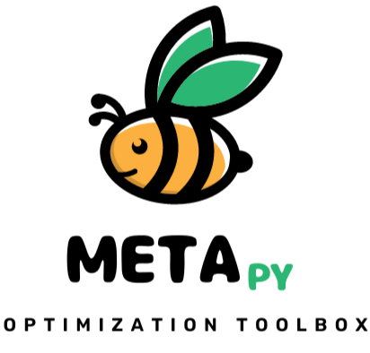

<table>
  <tr>
    <td style="width:70%;"><p align="justify">The METApy optimization toolbox is an easy of use environment for applying metaheuristic optimization methods. The platform has several optimization methods, as well as functions for generating charts and statistical analysis of the results.</p></td>
    <td style="width:30%;"></td>  
  </tr>
</table>  

{: .note }
> Any suggestion or error report in the functioning of the algorithm, please inform us by email: `wanderlei_junior@ufcat.edu.br`. We will be happy to improve the platform.

<h1>Requirements and install</h1>

<p align = "justify">
Use the command below to install the packages according to the configuration file.
</p>

```python
pip install -r requirements.txt
```

<p align = "justify">
Use the command below to install the framework.
</p>

```python
pip install META-TOOLBOX
```

<p align="justify">The METApy is available for installation and use in <b>Google Collaboratoy</b>, <b>Jupyter Notebook</b> or other <b>Python development environments</b>.</p>

<h3>PyPI repository</h3>
  
[PyPI repo](https://pypi.org/project/META-TOOLBOX/){:target="_blank"}{: .btn }

<!--
<h1>Developers</h1>

<p align="justify">See <a href="https://wmpjrufg.github.io/METAPY/001-VERSION.html" target="_blank">development team</a>.</p>   

<h1>Index</h1>

<dl>
  <dt>Quick start</dt>
    <dd><a href="https://wmpjrufg.github.io/METAPY/001-VERSION.html" target="_blank">Versions</a></dd>
    <dd><a href="https://wmpjrufg.github.io/METAPY/002-QUICK.html" target="_blank">Guide</a></dd>
  <dt>Deterministic Algorithms</dt>
    <dd><a href="https://wmpjrufg.github.io/METAPY/009-FIBONACCI.html" target="_blank">Fibonacci</a></dd>  
  <dt>Heuristic Algorithms</dt>
    <dd><a href="https://wmpjrufg.github.io/METAPY/003-HC.html" target="_blank">Hill Climbing</a></dd>
    <dd><a href="https://wmpjrufg.github.io/METAPY/004-SA.html" target="_blank">Simulated Annealing</a></dd>
    <dd><a href="https://wmpjrufg.github.io/METAPY/005-FA.html" target="_blank">Firefly algorithm</a></dd>
    <dd><a href="https://wmpjrufg.github.io/METAPY/006-PSO.html" target="_blank">Particle Swarm algorithm</a></dd>    
  <dt>Learning</dt>
    <dd><a href="https://wmpjrufg.github.io/METAPY/008-BENCHMARKS.html" target="_blank">Benchmarks and other functions</a></dd>
    <dd><a href="https://wmpjrufg.github.io/METAPY/007-KNAPSACK.html" target="_blank">Knapsack problem</a></dd>
</dl>


1.0 - Installation  
1.1 - [How to install](https://wmpjrufg.github.io/META_TOOLBOX/CAP_1-1.html)  
2.0 - Meta Optimization Toolbox   
2.1 - [How to use](https://wmpjrufg.github.io/META_TOOLBOX/CAP_2-1.html)  
3.0 - Optimization methods  
3.1 - [Simulated Annealing](https://wmpjrufg.github.io/META_TOOLBOX/CAP_3-1.html)  
3.0 - Optimization methods  
3.1 - [Simulated Annealing](https://wmpjrufg.github.io/META_TOOLBOX/CAP_3-1.html)
-->  

<!--
<dt>Common Library</dt>
<dd><a href="https://wmpjrufg.github.io/META_TOOLBOX/CO.html" target="_blank">Common Library</a></dd>
--> 


