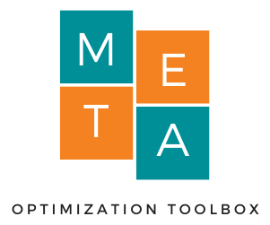

<h1>Welcome to META Optimization Toolbox</h1>

<table>
<tr>
<td style="width:70%;">
The META optimization toolbox is an easy-to-use environment for applying metaheuristic optimization methods. The platform has several optimization methods, as well as functions for generating charts and statistical analysis of the results.
</td>
<td style="width:30%;"></td>  
</tr>
</table>  

<h1>Developers</h1>

<h3><i>Main authors</i></h3>  
- [Mining Engineering João Vitor Coelho Estrela](http://lattes.cnpq.br/6824903350894586)  
- [Prof. Wanderlei Malaquias Pereira Junior](http://lattes.cnpq.br/2268506213083114)        

<h3><i>Research project Team</i></h3>  
- [Profa. Maria José Pereira Dantas](http://lattes.cnpq.br/5115002204148904)   
- [Prof. Edgar Marcos Ancioto Junior](http://lattes.cnpq.br/7117015785768463)    
- Aurélio Santos Miranda   
- Euller Santos Miranda
- Lucas Elias Andrade Cruvinel   

<h1>Index</h1>

<!--
1.0 - Installation  
1.1 - [How to install](https://wmpjrufg.github.io/META_TOOLBOX/CAP_1-1.html)  
2.0 - Meta Optimization Toolbox   
2.1 - [How to use](https://wmpjrufg.github.io/META_TOOLBOX/CAP_2-1.html)  
3.0 - Optimization methods  
3.1 - [Simulated Annealing](https://wmpjrufg.github.io/META_TOOLBOX/CAP_3-1.html)  
3.0 - Optimization methods  
3.1 - [Simulated Annealing](https://wmpjrufg.github.io/META_TOOLBOX/CAP_3-1.html)
-->   

<dl>
  <dt>Quick start</dt>
  <dd><a href="https://wmpjrufg.github.io/META_TOOLBOX/QUICK.html" target="_blank">Guide</a></dd>
  <dt>Common Library</dt>
  <dd><a href="https://wmpjrufg.github.io/META_TOOLBOX/CO.html" target="_blank">Common Library</a></dd>
  <dt>Algorithms</dt>
  <dd><a href="https://wmpjrufg.github.io/META_TOOLBOX/HC001.html" target="_blank">Hill Climbing (Continuous version)</a></dd>
</dl>

